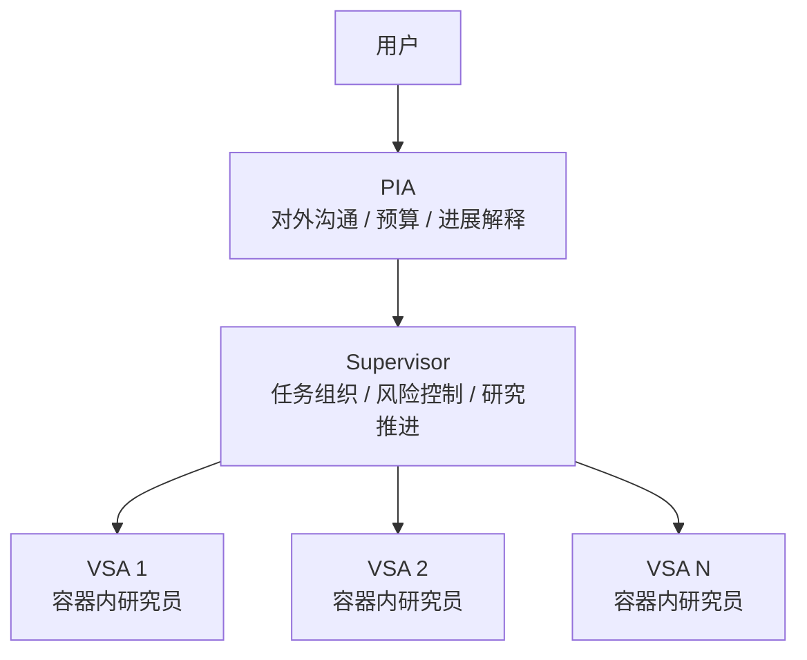

---
aliases:
  - Agent Capability Base
  - Agent 能力基座总纲
tags:
  - research-agent
  - framework-design
  - agent-capability
  - system-note
source_repo: scholar-agent
source_path: /home/xuyang/code/scholar-agent
last_local_commit: workspace aggregate
---
# Agent Capability Base：AINRF 研究角色能力基座总纲

> [!abstract]
> 本笔记定义 AINRF 中三类核心智能体角色的分工与能力基座术语：面向用户的 `PIA`、组织研究执行的 `supervisor`，以及工作在容器内的 `VSA`。它回答的不是 V1 API 怎么实现，而是“谁在研究系统里扮演什么角色、各自依赖什么类型的能力基座”。

## 核心图景

AINRF 中的研究角色按三层组织：

- `PIA`（principal investigator agent）：工作在 orchestrator 外层，负责对接用户、解释进度、沟通预算与范围、整理阶段成果和管理性文本。
- `supervisor`：工作在 orchestrator 内部控制面，负责组织一个或多个 `VSA` 开展研究、跟进进度、识别阻塞、在预算触顶或研究卡住时请求人工介入。
- `VSA`（vibe scientist agent）：工作在容器内的研究员，负责阅读材料、做调研、记账、做轻量实验、沉淀发现，并向 `supervisor` 做结构化汇报。

## 统一术语

- `preset`：一个角色的默认研究预设，包含其工作方式、知识资产和工具面。
- `skills`：预先教给 agent 的过程性知识、研究标准和 SOP。
- `tools`：AINRF 提供给 agent 的工作设备。对于本项目，`MCP` 与 `Unix-style CLI tools` 统一视为 `tools`。
- `behavior contract`：角色默认遵守的行为约定，例如如何汇报不确定性、何时请求人工介入、如何处理证据冲突。
- `capability base`：某一角色的能力基座，通常由 `behavior contract + skills + tools` 组成。

## 角色边界

### PIA

- 对用户说话，而不是直接替代容器内研究执行。
- 读取 orchestrator 的状态、日志、工件和阶段成果，将其转换成用户能理解的进展解释与管理性输出。
- 负责需求澄清、预算沟通、范围谈判和对外叙事，不直接承担多 VSA 编排。

详见 [[framework/pia-rfc]]。

### Supervisor

- 负责把高层研究目标拆成可执行任务，并派发给一个或多个 `VSA`。
- 跟进阶段进展、判断是否需要切换研究策略、何时应请求人工介入。
- 对上向 `PIA` 汇报研究推进与风险，对下协调 `VSA` 的任务边界和验收标准。

本轮只定义其高层能力域，不单独写首批能力清单。

### VSA

- 默认工作在容器内项目工作区。
- 负责具体研究动作：材料阅读、知识沉淀、发现生成、轻量实验和结构化记账。
- 主要沟通对象是 `supervisor`，而不是最终用户。

详见 [[framework/vsa-rfc]]。

## 能力基座分层

### VSA：完整能力基座

- `behavior contract`
- `skills`
- `tools`

VSA 是本轮能力基座建设的首发重点，因为它直接决定容器内研究员的默认工作方式和可调用设备。

### Supervisor：高层能力域

- 研究计划拆解与任务分配
- 多 VSA 协调与阶段推进
- 进展跟踪、阻塞识别与阶段验收
- 预算、风险与终止条件监控
- 向 `PIA` 汇报研究态势，并在必要时请求人工介入

### PIA：职责与对外产物导向

- 用户需求澄清与目标重述
- 基于 logs / artifacts / 状态的进展解释
- 预算、范围与优先级沟通
- 阶段成果汇报与管理性文本起草

## 当前规划优先级

- 首发先建设 `VSA` 的能力基座。
- `PIA` 本轮定义职责、能力域和典型产物，不展开详细工具/skills 清单。
- `supervisor` 本轮只写高层能力域，用来稳定三层角色边界。
- 本轮不把这套规划混入 `[[framework/v1-rfc]]` 或 `[[framework/v1-roadmap]]` 的实现主线。

## 关联笔记

- [[framework/index]]
- [[framework/vsa-rfc]]
- [[framework/pia-rfc]]
- [[framework/ai-native-research-framework]]
- [[framework/reference-mapping]]
