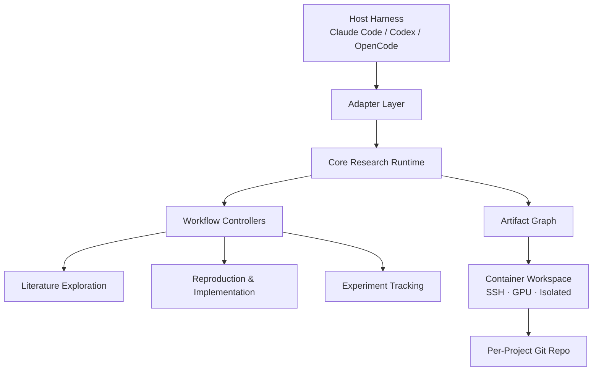

---
aliases:
  - AI-Native Research Framework
tags:
  - research-agent
  - framework-design
  - system-note
source_repo: scholar-agent
source_path: /home/xuyang/code/scholar-agent
last_local_commit: workspace aggregate
---
# AI-Native Research Framework：有界自治研究系统蓝图

> [!abstract]
> 这不是另一条固定 research pipeline，而是一个宿主无关、repo 优先、工件图谱驱动的研究系统。它要解决的问题是：如何让 Claude Code + Opus 等 agent 不只是"会读论文"或"会写报告"，而是能围绕论文、代码、实验和结论形成一个可审计、可复用、有界自治的研究操作系统。系统支持两种核心操作模式——调研发现、深度复现——并在隔离容器中自主执行研究任务。

## 框架定位

- 目标用户既包括要为研究工作流搭平台的团队，也包括直接使用 Claude Code + Opus 进行日常研究的实践者。
- 设计重心不是单次回答质量，而是研究资产如何沉淀、状态如何转换、人在关键节点如何定义合同边界。
- V1 的主要宿主是 Claude Code + Opus；核心工件模型保持宿主无关，宿主差异通过 adapter 吸收。
- 从现有参考项目抽象看，`everything-claude-code` 解决的是底盘，`ArgusBot` 解决的是监督式控制层，`AI-Research-SKILLs` 解决的是能力颗粒度，`ARIS` 和 `academic-research-skills` 解决的是长链路编排，`claude-scholar` 解决的是长期工作台；本框架试图把这些层统一成一个可组合系统。

## 双模式概览

- **Mode 1 — 调研发现**：给定若干篇种子文章、论文材料，或直接给定一段文字叙述，系统先与用户交互式澄清问题边界，再自主围绕目标方向及潜在创新点开展文献扩展、笔记撰写、实验方法总结、研究图景构建、知识树状/网状图更新与机会发现；按深度上限/预算/递减收益自动终止，产出调研发现报告、潜在 idea 方向、用户 idea 的可行性验证分析，以及陌生领域所需的研究史与前沿趋势总结。
- **Mode 2 — 深度复现**：给定一篇没有开源代码的论文，系统从零实现论文方法，按实验设置高精度复现文中表格，产出可运行代码、实验结果、偏差分析和对论文含金量、可复现性、方法科学性的结构化评估。

## 设计原则

- 宿主无关：核心工件模型与状态机独立于 Claude/Codex/OpenCode，宿主差异通过 adapter 吸收。
- Repo 优先：代码、配置、实验日志、复现记录和研究产物都优先落在可版本化目录中，而不是只存在会话记忆里。每个研究项目在容器上是独立的 git repo。
- 工件优先于流程：流程只是工件之间的状态转换，不把线性 stage 当成唯一真相。
- 有界自治：系统在人类预设的合同边界内自主运行——包括递归深度上限、预算上限、时间上限和 agent 自评递减收益检测。不是开放式自治，也不是逐步审批；是在明确合同内自由行动，合同外必须停下。
- 失败可记账：复现失败、实验失败、证据冲突都不是异常分支，而是正式研究资产。

## 系统边界

- In scope：论文阅读、结构化证据抽取、交互式需求澄清、文献递归探索与自动终止、结构化文献笔记、方法脉络与实验方法总结、领域研究图景建模、知识树状/网状图动态更新、潜在 idea 方向发现、用户 idea 的可行性分析报告、从零实现论文方法（无开源代码场景）、实验追踪与高精度表格复现、偏差归因、结果归档、论文含金量与可复现性的结构化评估、下游写作接口。
- Out of scope for V1：自动把论文写到可投稿质量、自动完成 rebuttal 与投稿合规、容器生命周期管理（外部负责）、数据集自动获取（用户提供或手动下载）。
- 一个关键推论是：V1 不应该被定义为"paper writing agent"，而应该被定义为"bounded-autonomous research evidence engine"。

## 分层视图

## 核心主张

- 平台层负责接入宿主能力、权限模型、长任务执行和可观测性。
- 核心运行时负责统一任务语义，例如"读一篇论文""启动一次复现""从零实现一个方法""归档一次实验"。
- 工件图谱层负责维持研究状态，不让系统退化为一堆互不相干的 Markdown 与脚本。
- 工作流控制器负责把一等工件串起来，但它本身不能成为新的单点耦合源。
- 执行平面运行在隔离容器上（SSH 接入、GPU 资源、完全 root 权限），框架定义工作区约定但不管理容器生命周期。

## 人工关卡

系统保留两个显式关卡，其余环节在预设合同内自治：

- **纳入关卡**：人决定哪些文章/论文材料或研究问题叙述进入系统（Mode 1），或哪些论文进入深度复现（Mode 2）。
- **计划关卡**：人审批调研或复现计划——包括关注方向、忽略方向、资源预算（GPU 时间、API 费用、总时长）、递归深度上限和终止条件。

预算和归档不再是阻塞式关卡，而是"合同与验证"模式：人在计划阶段预授权资源边界，agent 在边界内自主执行；结果（包括失败）全量归档，人事后审阅而非执行中逐一审批。

## 不是要复制什么

- 不复制 `ARIS` 的无约束自治默认——系统可以过夜运行，但在合同之内，不是空白支票。吸收其 nightly loop、实验执行链和跨模型 review 思路，但附加终止合同。
- 不复制 `academic-research-skills` 的完整投稿工厂，因为这会过早把系统重心拉向写作。
- 不复制 `AI-Research-SKILLs` 的纯技能市场形态，因为那会让工件状态和流程责任继续外溢到宿主。

## 关联笔记

- [[framework/index]]
- [[framework/artifact-graph-architecture]]
- [[framework/v1-dual-mode-research-engine]]
- [[framework/container-workspace-protocol]]
- [[framework/reference-mapping]]
- [[summary/academic-research-agents-overview]]
