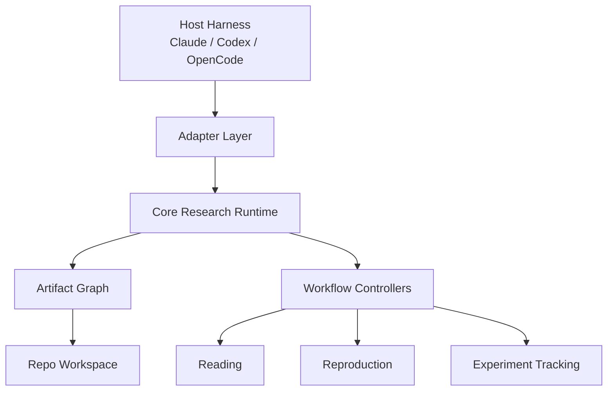

---
aliases:
  - AI-Native Research Framework
tags:
  - research-agent
  - framework-design
  - system-note
source_repo: scholar-agent
source_path: /home/xuyang/code/scholar-agent
last_local_commit: workspace aggregate
---
# AI-Native Research Framework：面向 Agent 平台团队的研究系统蓝图

> [!abstract]
> 这不是另一条固定 research pipeline，而是一个宿主无关、repo 优先、工件图谱驱动的研究系统蓝图。它要解决的问题是：如何让 Claude、Codex、OpenCode 一类 agent 不只是“会读论文”或“会写报告”，而是能围绕论文、代码、实验和结论形成一个可审计、可复用、可渐进自动化的研究操作系统。

## 框架定位

- 它的目标读者不是单个 prompt user，而是要为研究工作流搭平台的团队。
- 设计重心不是单次回答质量，而是研究资产如何沉淀、状态如何转换、人工关卡如何介入。
- 从现有参考项目抽象看，`everything-claude-code` 解决的是底盘，`ArgusBot` 解决的是监督式控制层，`AI-Research-SKILLs` 解决的是能力颗粒度，`ARIS` 和 `academic-research-skills` 解决的是长链路编排，`claude-scholar` 解决的是长期工作台；本框架试图把这些层统一成一个可组合系统。

## 设计原则

- 宿主无关：核心工件模型与状态机独立于 Claude/Codex/OpenCode，宿主差异通过 adapter 吸收。
- Repo 优先：代码、配置、实验日志、复现记录和研究产物都优先落在可版本化目录中，而不是只存在会话记忆里。
- 工件优先于流程：流程只是工件之间的状态转换，不把线性 stage 当成唯一真相。
- 半自动优先于全自动：先让系统成为研究副驾，确保每个关键节点可审计，再向 FARS 风格的更强自治推进。
- 失败可记账：复现失败、实验失败、证据冲突都不是异常分支，而是正式研究资产。

## 系统边界

- In scope：论文阅读、结构化证据抽取、方法级复现、实验追踪、偏差归因、结果归档、下游写作接口。
- Out of scope for V1：自动把论文写到可投稿质量、自动打平主表结果、自动完成 rebuttal 与投稿合规。
- 一个关键推论是：V1 不应该被定义为“paper writing agent”，而应该被定义为“research evidence engine with human gates”。

## 分层视图

## 核心主张

- 平台层负责接入宿主能力、权限模型、长任务执行和可观测性。
- 核心运行时负责统一任务语义，例如“读一篇论文”“启动一次复现”“归档一次实验”。
- 工件图谱层负责维持研究状态，不让系统退化为一堆互不相干的 Markdown 与脚本。
- 工作流控制器负责把一等工件串起来，但它本身不能成为新的单点耦合源。

## 关键人工关卡

- 论文纳入：决定某篇论文是否进入结构化阅读与复现队列。
- 复现计划批准：确认目标、成功标准、可接受资源消耗与终止条件。
- 实验预算批准：防止 agent 自主扩张实验规模。
- 结果归档确认：决定哪些 run、哪些偏差、哪些结论进入正式资产层。

## 不是要复制什么

- 不复制 `ARIS` 的“尽量一夜跑完所有事”叙事，因为 V1 目标不是最大自治。
- 不复制 `academic-research-skills` 的完整投稿工厂，因为这会过早把系统重心拉向写作。
- 不复制 `AI-Research-SKILLs` 的纯技能市场形态，因为那会让工件状态和流程责任继续外溢到宿主。

## 关联笔记

- [[framework/index]]
- [[framework/artifact-graph-architecture]]
- [[framework/v1-semi-automatic-research-copilot]]
- [[framework/reference-mapping]]
- [[summary/academic-research-agents-overview]]
