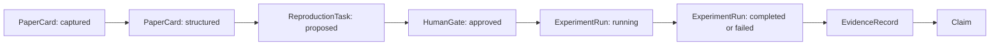

---
aliases:
  - Research Artifact Graph
tags:
  - research-agent
  - framework-design
  - architecture
source_repo: scholar-agent
source_path: /home/xuyang/code/scholar-agent
last_local_commit: workspace aggregate
---
# 工件图谱架构：AI-Native Research Framework 的核心模型

> [!abstract]
> 如果没有统一工件模型，研究系统就会退化成“几个 skill + 一堆输出文件”。这份笔记定义框架中的一等对象、层间边界和状态转换，确保后续无论接 Claude 还是 Codex，读论文、复现和实验追踪都在同一张图里。

## 一等工件

- `ResearchProject`：研究任务容器，聚合论文、代码仓库、实验 run、结论和决策记录。
- `PaperCard`：单篇论文的结构化阅读对象，记录问题定义、方法摘要、关键 claim、依赖资产和复现价值。
- `ReproductionTask`：对某篇论文或某个方法发起的复现任务，包含目标、入口、依赖、成功标准和停止条件。
- `ExperimentRun`：一次实际执行，包含配置、日志、指标、产物、资源消耗和失败原因。
- `EvidenceRecord`：从论文、代码、实验和人工评注中抽出的可引用证据单元。
- `Claim`：系统或研究者接受的判断，必须能回溯到一个或多个 `EvidenceRecord`。
- `HumanGate`：人工审批节点，用来显式表达“此处不能让 agent 自行决定”。
- `AgentAdapter`：宿主适配接口，只把宿主能力映射为统一研究动作，不保存研究真相。

## 层次拆分

- 平台层：会话管理、权限、远程执行、可观测性、多 agent 调度。
- 运行时层：统一动作语义，如 ingest paper、plan reproduction、launch run、archive evidence。
- 图谱层：对象关系、状态、依赖和追溯链。
- 存储层：repo/workspace 中的 Markdown、JSON、实验目录、脚本与结果文件。

## 状态转换

## Repo 优先的数据平面

- Source of truth 放在 repo/workspace，而不是笔记库；笔记负责解释、导航和设计，不负责承载唯一运行状态。
- 一个直接后果是：实验日志、环境说明、偏差分析、run manifest 都应与代码和结果一起版本化。
- Obsidian 风格文档仍然重要，但它们是人可读索引和知识层，而不是执行状态数据库。

## Adapter 责任边界

- Adapter 可以决定“如何在 Claude/Codex 上发起任务”，但不能改变 `PaperCard`、`ReproductionTask`、`ExperimentRun` 的语义。
- Adapter 可以补充宿主特有能力，例如 Claude 的 commands、Codex 的工具调用、OpenCode 的 session 管理。
- 一旦工件落库，后续任何宿主都应能接手，而不依赖原始会话上下文。

## 失败模式也是正式状态

- 复现失败要能区分环境失败、依赖损坏、代码入口缺失、算力不足、结果偏差过大。
- 证据冲突要能明确是论文 claim 不可验证，还是实验设计尚不足以支持结论。
- 这类失败不应该被埋在日志里，而应提升为 `ExperimentRun` 和 `EvidenceRecord` 的一部分。

## 对写作模块的接口

- V1 不细化 `ManuscriptDraft`，但应保留一个清晰前提：后续写作模块只能消费已经归档的 `Claim`、`EvidenceRecord` 与 `ExperimentRun`。
- 这使写作成为研究资产的下游视图，而不是新的 source of truth。

## 关联笔记

- [[framework/index]]
- [[framework/ai-native-research-framework]]
- [[framework/v1-semi-automatic-research-copilot]]
- [[projects/everything-claude-code]]
- [[projects/ai-research-skills]]
