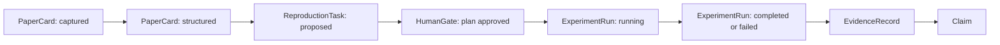
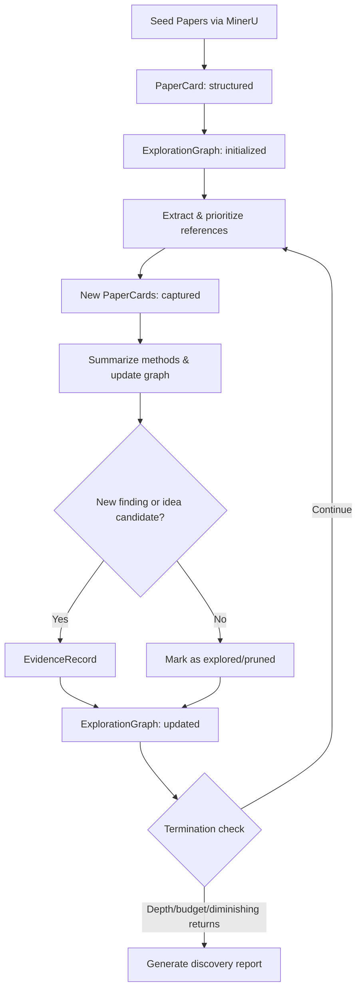
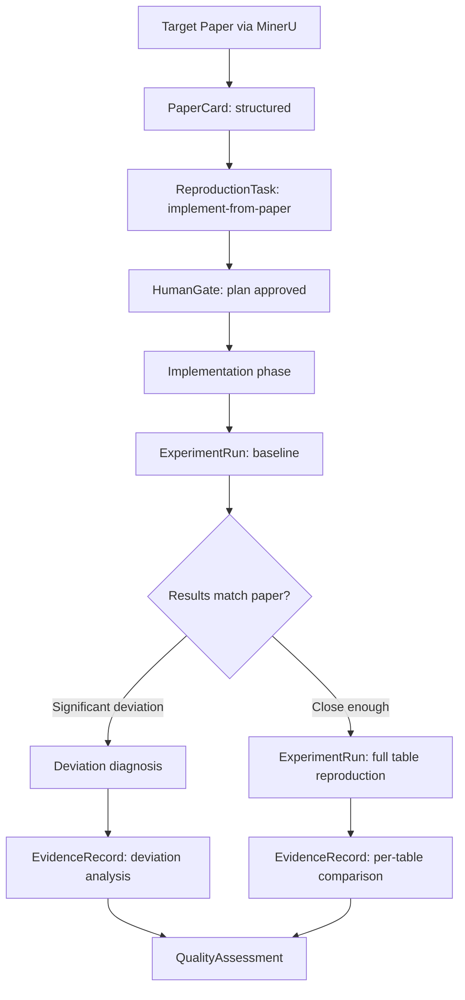

---
aliases:
  - Research Artifact Graph
tags:
  - research-agent
  - framework-design
  - architecture
source_repo: scholar-agent
source_path: /home/xuyang/code/scholar-agent
last_local_commit: workspace aggregate
---
# 工件图谱架构（历史文档）

> [!warning]
> 本文档保留为历史架构蓝图。它记录的是早期 `artifact graph` 作为框架核心模型时的对象体系与层次拆分，不再是当前 next release 的主要阅读入口或实现约束。

> [!abstract]
> 这份文档仍然适合用于理解 `PaperCard`、`ExperimentRun`、`ExplorationGraph`、`QualityAssessment` 等术语的来源，也能帮助回看项目曾经如何把研究状态组织成统一图谱。但当前项目已把 next release 收敛到 task-centric dashboard baseline，因此这里的完整图谱叙事应按历史设计理解。

## 一等工件

- `ResearchProject`：研究任务容器，聚合论文、代码仓库、实验 run、结论和决策记录。对应容器上的一个独立 git repo。
- `PaperCard`：单篇论文的结构化阅读对象，记录问题定义、方法摘要、关键 claim、依赖资产和研究价值。
- `ReproductionTask`：对某篇论文或某个方法发起的复现任务，包含目标、入口、依赖、成功标准和停止条件。区分两种策略：`reproduce-from-source`（有开源代码，复现已有实现）和 `implement-from-paper`（无开源代码，从论文描述从零实现，Mode 2 主路径）。
- `ExperimentRun`：一次实际执行，包含配置、日志、指标、产物、资源消耗和失败原因。
- `EvidenceRecord`：从论文、代码、实验和人工评注中抽出的可引用证据单元。
- `Claim`：系统或研究者接受的判断，必须能回溯到一个或多个 `EvidenceRecord`。
- `ExplorationGraph`：Mode 1 专属工件，跟踪调研发现过程中的前沿状态——哪些 PaperCard 已访问、哪些排队中、哪些产生了新发现或 idea 候选、哪些被剪枝、当前递归深度和预算消耗。没有它，递归调研在工件模型中没有显式表示。
- `QualityAssessment`：Mode 2 专属工件，将多个 Claim 汇聚为对目标论文的结构化评估——含金量（方法是否有实质贡献）、可复现性（结果是否可重现）、方法科学性（实验设计是否严谨）。比泛化的 `Claim` 更结构化，适合作为最终可交付评估报告。
- `WorkspaceManifest`：容器工作区状态——目录布局、环境配置、已安装依赖、GPU 可用性、资源消耗。使执行环境成为可审计工件而非隐式上下文。详见 [[framework/container-workspace-protocol]]。
- `HumanGate`：人工审批节点，用来显式表达"此处不能让 agent 自行决定"。V1 保留两个显式关卡：纳入关卡和计划关卡。预算和归档在计划阶段预授权后，agent 在合同内自治。
- `AgentAdapter`：宿主适配接口，只把宿主能力映射为统一研究动作，不保存研究真相。

## 层次拆分

- 平台层：会话管理、权限、远程执行（SSH 到隔离容器）、可观测性、多 agent 调度。
- 运行时层：统一动作语义，如 ingest paper、plan reproduction、implement from paper、launch run、archive evidence。
- 图谱层：对象关系、状态、依赖和追溯链。
- 存储层：容器上 per-project git repo 中的 Markdown、JSON、实验目录、脚本与结果文件。

## 状态转换

### 基础流程（通用）

### Mode 1 — 调研发现

### Mode 2 — 深度复现

## Repo 优先的数据平面

- Source of truth 放在容器上的 per-project git repo 中，而不是笔记库；笔记负责解释、导航和设计，不负责承载唯一运行状态。
- 一个直接后果是：实验日志、环境说明、偏差分析、run manifest 都应与代码和结果一起版本化。
- Obsidian 风格文档仍然重要，但它们是人可读索引和知识层，而不是执行状态数据库。
- 容器工作区的目录结构和同步协议详见 [[framework/container-workspace-protocol]]。

## Adapter 责任边界

- Adapter 可以决定"如何在 Claude/Codex 上发起任务"，但不能改变 `PaperCard`、`ReproductionTask`、`ExperimentRun` 的语义。
- Adapter 可以补充宿主特有能力，例如 Claude 的 commands、Codex 的工具调用、OpenCode 的 session 管理。
- 一旦工件落库，后续任何宿主都应能接手，而不依赖原始会话上下文。

## 失败模式也是正式状态

- 复现失败要能区分：环境失败、依赖损坏、代码入口缺失、算力不足、结果偏差过大。
- 证据冲突要能明确是论文 claim 不可验证，还是实验设计尚不足以支持结论。
- MinerU 解析失败（PDF 结构无法提取）应记录为 `EvidenceRecord`，标注原因，不阻塞整体流程。
- Mode 2 实现失败（论文方法描述不充分，无法从零实现）应记录为 `ReproductionTask: blocked`，附带具体卡点说明。
- Mode 1 深度/预算耗尽（探索未收敛即触顶）应在 `ExplorationGraph` 中标注终止原因和当前前沿状态。
- 容器环境不匹配（缺少依赖、GPU 显存不足）应记录为 `ExperimentRun: env_failure`。
- 这类失败不应该被埋在日志里，而应提升为一等工件的正式状态。

## 对写作模块的接口

- V1 不细化 `ManuscriptDraft`，但应保留一个清晰前提：后续写作模块只能消费已经归档的 `Claim`、`EvidenceRecord`、`ExperimentRun` 和 `QualityAssessment`。
- 这使写作成为研究资产的下游视图，而不是新的 source of truth。

## 关联笔记

- [[framework/index]]
- [[framework/ai-native-research-framework]]
- [[framework/v1-dual-mode-research-engine]]
- [[framework/container-workspace-protocol]]
- [[projects/everything-claude-code]]
- [[projects/ai-research-skills]]
