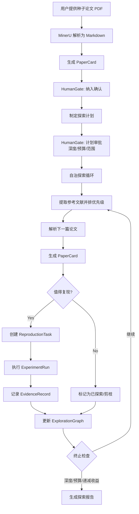
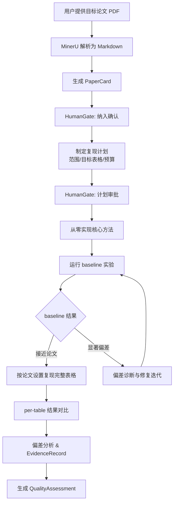

---
aliases:
  - 双模式研究引擎 V1
  - 半自动研究副驾 V1
tags:
  - research-agent
  - framework-design
  - v1-spec
source_repo: scholar-agent
source_path: /home/xuyang/code/scholar-agent
last_local_commit: workspace aggregate
---
# V1：双模式有界自治研究引擎

> [!abstract]
> V1 支持两种核心操作模式：文献探索与复现（Mode 1）和深度复现（Mode 2）。系统在人类预设的合同边界内自主运行——人在纳入和计划阶段定义边界，agent 在边界内自治执行、全量归档。执行环境是隔离容器（SSH、GPU、root），每个研究项目是独立 git repo。

## V1 目标

**工件升级（两种模式共享）：**

- 把论文阅读从自由文本总结升级为结构化 `PaperCard`。
- 把复现从"一次性跑脚本"升级为可跟踪的 `ReproductionTask`（区分 `reproduce-from-source` 与 `implement-from-paper`）。
- 把实验从零散命令历史升级为正式 `ExperimentRun` 账本。
- 为后续写作模块留下标准化输入，而不是直接在 V1 里追求投稿级成稿。

**Mode 1 专属目标：**

- 从种子论文出发，自主递归探索相关文献，构建 `ExplorationGraph`。
- 对高价值论文进行选择性复现，产出复现报告和核心发现。
- 按深度上限、预算上限和递减收益自动终止探索。
- 输出下一步探索方向建议和 idea 验证报告。

**Mode 2 专属目标：**

- 对没有开源代码的论文，从零实现论文提出的方法。
- 按论文实验设置高精度复现指定表格和结果。
- 产出对论文含金量、可复现性和方法科学性的结构化评估 `QualityAssessment`。
- 用户可设定预算和范围——仅核心方法或完整实验套件。

## 输入与输出

### Mode 1 — 文献探索与复现

**输入：**

- 种子论文：用户提供的 PDF 文件，经 MinerU API 解析为 Markdown。
- 领域上下文：用户对研究方向的简要说明，帮助 agent 判断论文相关性。
- 终止合同：递归深度上限（如 3 跳）、总预算上限（GPU 小时、API 费用、总时长）。
- 可选：用户标注的重点关注方向或需要忽略的子领域。

**输出：**

- `ExplorationGraph`：完整的探索前沿状态，包含所有已访问、排队和剪枝的 PaperCard。
- 文献复现报告：对已复现论文的结果记录与偏差分析。
- 核心发现（core findings）：从探索中提炼的关键洞察。
- 下一步探索方向建议：agent 对未来研究的具体建议。
- idea 验证报告：对初步想法的可行性评估。

### Mode 2 — 深度复现

**输入：**

- 目标论文：用户提供的 PDF 文件，经 MinerU API 解析为 Markdown。
- 范围指令：`core-only`（仅实现核心方法和关键实验）或 `full-suite`（完整实验套件）。
- 目标表格/结果：用户指定需要复现的具体表格或实验。
- 预算上限：GPU 小时、API 费用、总时长。

**输出：**

- 可运行的实现代码（`src/` 目录，含 README 和依赖说明）。
- 实验结果：per-table 的定量对比（论文报告值 vs 复现值）。
- 偏差分析：对每个显著偏差的根因诊断。
- `QualityAssessment`：对论文的结构化评估——
  - 含金量：方法是否有实质技术贡献，还是增量改进。
  - 可复现性：按论文描述能否重现声称的结果，偏差多大。
  - 方法科学性：实验设计是否严谨，消融是否充分，比较基线是否合理。

## 主工作流

### Mode 1 工作流

### Mode 2 工作流

## 工作流细化

### Mode 1 细化

- **Paper intake**：通过 MinerU 将种子论文 PDF 解析为 Markdown，抽取问题、方法、依赖、主要 claim、参考文献列表。
- **探索排优先级**：根据引用频次、与种子论文的方法相关性、发表时间和 venue 排序参考文献。用户提供的领域上下文用于相关性判断。
- **选择性复现**：不是每篇论文都复现。Agent 根据以下标准决定是否发起 ReproductionTask：方法是否与种子论文的核心方法相关、是否有足够的实验描述支持复现、复现预期成本是否在剩余预算内。
- **终止决策**：三个维度的 OR 逻辑——递归深度达到上限、预算（GPU 时间/API 费用/总时长）耗尽、agent 自评后续探索的边际价值低于阈值（连续 N 篇论文无新发现）。

### Mode 2 细化

- **Paper intake**：通过 MinerU 解析目标论文，重点抽取方法描述（模型架构、损失函数、训练细节）、实验设置（数据集、超参数、评估指标）和目标表格。
- **实现策略**：使用标准 ML 库（PyTorch、HuggingFace Transformers 等）从零实现论文方法。优先实现核心模块（模型架构、关键 loss），再搭建训练和评估 pipeline。
- **实验复现**：先跑通 baseline（小规模数据、短 epoch）确认代码正确性，再按论文完整设置运行。对 `full-suite` 范围，逐表复现论文结果。
- **偏差处理**：偏差分为可接受偏差（随机种子、硬件差异导致的小波动）和需要诊断的偏差（>5% 相对偏差）。对显著偏差进行根因分析并记录为 `EvidenceRecord`。
- **质量评估**：基于复现结果和全过程证据，生成 `QualityAssessment`。即使复现失败，结构化的失败分析本身也是有价值的输出。

## 人工关卡

V1 保留两个显式关卡：

| 关卡 | 适用模式 | 内容 |
| --- | --- | --- |
| 纳入关卡 | Mode 1 & 2 | 人决定哪些论文进入系统：种子论文（Mode 1）或目标论文（Mode 2）。 |
| 计划关卡 | Mode 1 & 2 | 人审批复现/探索计划——包括范围（Mode 2：core-only vs full-suite）、资源预算、递归深度上限（Mode 1）和终止条件。 |

预算和归档不再是阻塞式关卡。预算在计划阶段预授权，agent 在边界内自主执行；结果（成功和失败）全量归档，人事后审阅。

## V1 Done 定义

**Mode 1：**

- 用户提供种子论文后，系统能自主完成文献递归探索并在深度/预算/递减收益条件下稳定终止。
- 产出结构化的 `ExplorationGraph`、复现报告和下一步建议。
- 探索过程中的失败（解析失败、复现失败、环境问题）被记录为正式工件状态。

**Mode 2：**

- 用户提供无开源代码的论文后，系统能从零实现论文方法并尝试高精度复现目标表格。
- 产出可运行代码、per-table 结果对比、偏差分析和 `QualityAssessment`。
- 复现失败（方法描述不足、结果不可重现）本身是有价值的正式输出。

**通用：**

- 不同宿主接入时，核心对象和状态定义保持一致，不重写业务语义。
- 文档层能明确说明 V1 如何向未来的写作系统和更强自动化系统交接。

## 明确不做

- 不做投稿级论文写作、review 和 rebuttal。
- 不管理容器生命周期（创建、启动、停止、销毁由外部负责）。
- 不自动获取数据集（用户提供或在计划阶段明确数据来源）。
- 不保证复现一定成功——结构化的失败分析本身是正式产出，不是系统故障。

## 关联笔记

- [[framework/index]]
- [[framework/ai-native-research-framework]]
- [[framework/artifact-graph-architecture]]
- [[framework/container-workspace-protocol]]
- [[framework/reference-mapping]]
- [[projects/auto-claude-code-research-in-sleep]]
