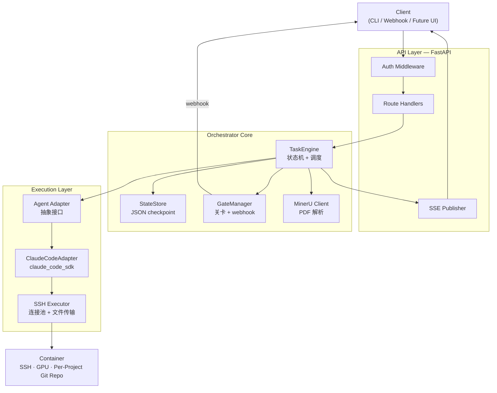
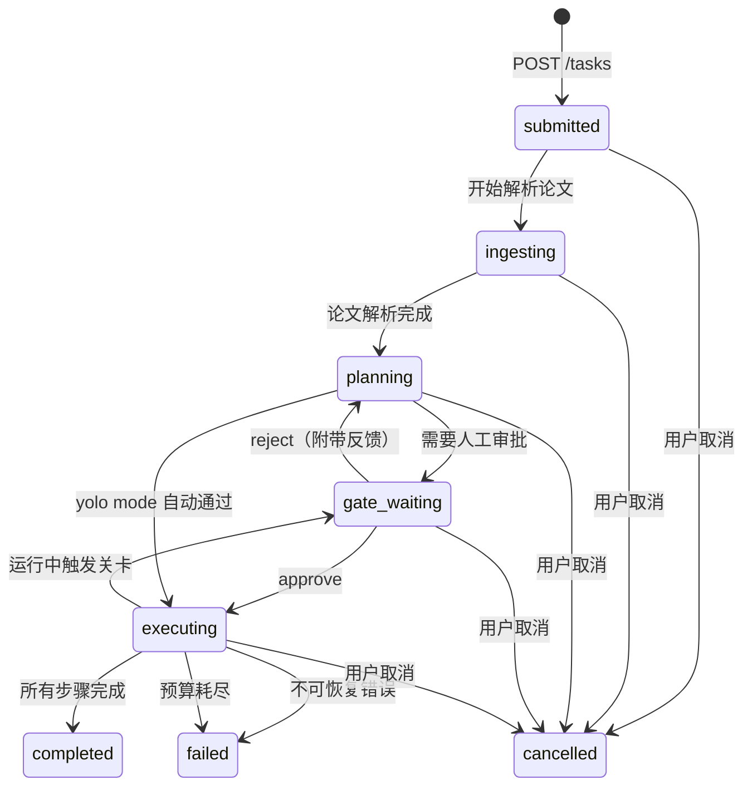
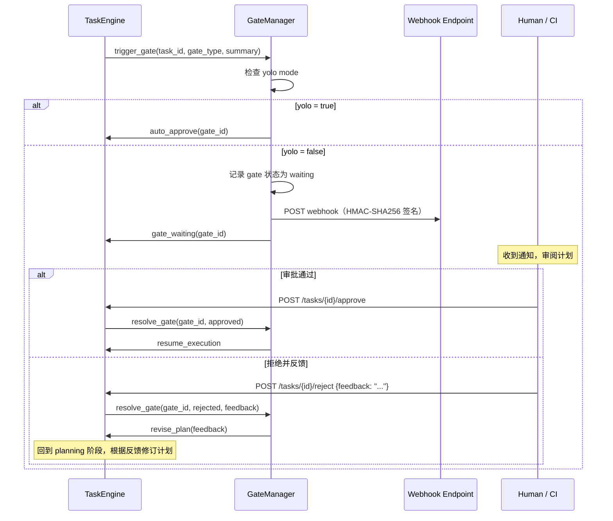

---
aliases:
  - AINRF V1 RFC
  - V1 实现规格
tags:
  - research-agent
  - framework-design
  - v1-spec
  - rfc
source_repo: scholar-agent
source_path: /home/xuyang/code/scholar-agent
last_local_commit: workspace aggregate
---
# AINRF V1 RFC：有界自治研究引擎实现规格

> [!abstract]
> 定位：把框架设计文档的"做什么"翻译成"怎么做"。[[framework/ai-native-research-framework]] 定义了愿景与原则，[[framework/artifact-graph-architecture]] 定义了工件模型，[[framework/v1-dual-mode-research-engine]] 定义了双模式工作流与终止合同，[[framework/container-workspace-protocol]] 定义了容器执行环境。本 RFC 在此基础上给出可部署的服务架构、API 设计、组件规格和实现路径——从蓝图到可运行系统的最后一公里。

## Problem Statement & Motivation

### 缺口

框架文档已经定义了完整的工件模型（PaperCard、ReproductionTask、ExperimentRun 等）、双模式工作流（文献探索与深度复现）、人工关卡（纳入 + 计划）和容器工作区协议。但这些设计停留在"做什么"层面，缺少以下关键实现决策：

- 系统以什么形态运行？CLI 工具、daemon 服务还是 serverless 函数？
- 外部系统（CI/CD、webhook、未来 UI）如何与研究引擎交互？
- 任务状态如何持久化？orchestrator 崩溃后如何恢复？
- Claude Code 如何被调用？直接 subprocess 还是 SDK？
- 人工关卡如何从"设计概念"变成"可调用的 API"？

### 为什么是 REST 服务而非 CLI

| 维度 | CLI 方案 | REST 服务方案 |
|------|---------|-------------|
| 部署位置 | 必须在容器本地或有 SSH 的机器上 | 任意位置，只需网络可达 |
| Webhook 集成 | 需要额外轮询脚本 | 原生支持，关卡触发直接 POST |
| 实时进度 | 只能 tail 日志 | SSE 推送 + 轮询端点 |
| 未来 UI | 需要包装层 | 天然 API-first |
| 多任务管理 | 多终端窗口 | 统一任务队列 |
| 可观测性 | 散落在日志文件中 | 结构化事件流 |

结论：REST 服务是 V1 的正确形态。它不排斥 CLI——CLI 可以作为 REST 客户端存在，但核心是 API-first。

## System Architecture Overview

### 三层架构

系统分为三层，职责严格隔离：

- **API Layer（FastAPI）**：接收外部请求、认证、参数校验、SSE 推送。不包含任何研究语义。
- **Orchestrator Core（TaskEngine + StateStore + GateManager）**：任务生命周期管理、状态持久化、关卡协调、checkpoint/resume。这是系统的大脑。
- **Execution Layer（SSH Executor + Agent Adapter）**：通过 SSH 连接容器，调用 Claude Code SDK 执行原子研究任务。不保存研究状态，只负责"在容器上执行并返回结果"。

### 架构总览



### 部署模型

- Orchestrator 运行在任意有网络访问的机器上（本地开发机、云 VM、CI runner）。
- 容器通过 SSH 接入，orchestrator 不需要与容器在同一网络。
- V1 采用 1:1 映射：一个 orchestrator 实例管理一个容器。数据模型预留 `container_id` 字段，为未来 1:N 做准备。
- V1 任务顺序执行。TaskEngine 内部使用队列，但同一时刻只有一个任务在执行。并发调度留给 V2。

## API Design

### Authentication

V1 使用 API Key 认证，简单可靠：

- 客户端在请求头中携带 `X-API-Key: <key>`。
- 服务端存储 key 的 SHA-256 哈希值，不存明文。
- 认证失败返回 `401 Unauthorized`，不泄露 key 是否存在。
- 扩展路径：V2 可引入 JWT bearer token 或 OAuth2，API Layer 的 auth middleware 设计为可插拔。

> [!tip]
> V1 建议通过 reverse proxy（如 Caddy/Nginx）终止 TLS，FastAPI 本身不处理 HTTPS。这样 API key 在传输层有加密保护。

### Endpoints

| Endpoint | Method | 用途 | 认证 |
|---|---|---|---|
| `/tasks` | `POST` | 提交研究任务 | 需要 |
| `/tasks` | `GET` | 列出任务（支持 `?status=` 过滤） | 需要 |
| `/tasks/{id}` | `GET` | 获取任务详情（含当前阶段、工件列表、预算消耗） | 需要 |
| `/tasks/{id}/approve` | `POST` | 审批通过人工关卡 | 需要 |
| `/tasks/{id}/reject` | `POST` | 拒绝并附带反馈（触发计划修订） | 需要 |
| `/tasks/{id}/cancel` | `POST` | 取消正在执行的任务（优雅终止） | 需要 |
| `/tasks/{id}/events` | `GET` | SSE 事件流（实时进度） | 需要 |
| `/health` | `GET` | 健康检查（含容器连通性） | 不需要 |

### Task Submission Schema

任务提交使用 JSON POST body。以下是完整 schema：

```json
{
  "mode": "literature_exploration | deep_reproduction",
  "papers": [
    {
      "title": "Attention Is All You Need",
      "pdf_url": "https://arxiv.org/pdf/1706.03762",
      "pdf_path": "/local/path/to/paper.pdf",
      "role": "seed | target"
    }
  ],
  "config": {
    "mode_1": {
      "domain_context": "Transformer 架构在长序列建模中的效率优化",
      "max_depth": 3,
      "focus_directions": ["linear attention", "sparse attention"],
      "ignore_directions": ["vision transformer"]
    },
    "mode_2": {
      "scope": "core-only | full-suite",
      "target_tables": ["Table 1", "Table 3"],
      "baseline_first": true
    }
  },
  "container": {
    "host": "gpu-server-01",
    "port": 22,
    "user": "researcher",
    "ssh_key_path": "/path/to/id_rsa",
    "project_dir": "/workspace/projects/attention-study"
  },
  "budget": {
    "gpu_hours": 24,
    "api_cost_usd": 50,
    "wall_clock_hours": 48
  },
  "yolo": false,
  "webhook_url": "https://example.com/hooks/ainrf",
  "webhook_secret": "hmac-shared-secret"
}
```

字段说明：

- `mode`：必填。`literature_exploration` 对应 Mode 1，`deep_reproduction` 对应 Mode 2。
- `papers`：必填。至少一篇。`pdf_url` 和 `pdf_path` 二选一，系统优先使用本地路径。`role` 在 Mode 1 中为 `seed`，Mode 2 中为 `target`。
- `config.mode_1`：Mode 1 专属配置。`domain_context` 帮助 agent 判断论文相关性；`max_depth` 控制递归探索深度；`focus_directions` 和 `ignore_directions` 引导探索方向。
- `config.mode_2`：Mode 2 专属配置。`scope` 决定复现范围；`target_tables` 指定需要复现的表格；`baseline_first` 控制是否先跑小规模验证。
- `container`：必填。SSH 连接信息和项目目录。目录结构遵循 [[framework/container-workspace-protocol]] 定义的约定。
- `budget`：必填。三个维度的预算上限，任一维度触顶即终止。
- `yolo`：可选，默认 `false`。设为 `true` 时跳过所有人工关卡，自动审批通过。适用于信任度高的重复性任务。
- `webhook_url` / `webhook_secret`：可选。配置后，关卡等待和任务完成时发送 webhook 通知。

### SSE Event Types

客户端通过 `GET /tasks/{id}/events` 建立 SSE 连接，接收实时事件。每个事件包含 `event` 类型和 JSON `data`。

#### task.stage_changed

任务阶段转换时触发。

```json
{
  "event": "task.stage_changed",
  "data": {
    "task_id": "t-20260315-001",
    "previous_stage": "ingesting",
    "current_stage": "planning",
    "timestamp": "2026-03-15T10:30:00Z",
    "message": "论文解析完成，开始制定探索计划"
  }
}
```

#### task.progress

执行过程中的进度更新，粒度为原子任务级别。

```json
{
  "event": "task.progress",
  "data": {
    "task_id": "t-20260315-001",
    "stage": "executing",
    "step": "explore_paper",
    "step_index": 5,
    "total_steps": 12,
    "detail": "正在解析第 5 篇论文: Linear Transformers Are Secretly Fast",
    "budget_consumed": {
      "gpu_hours": 2.3,
      "api_cost_usd": 8.5,
      "wall_clock_hours": 3.1
    },
    "timestamp": "2026-03-15T13:10:00Z"
  }
}
```

#### task.gate_waiting

人工关卡触发，等待审批。同时通过 webhook 发送通知。

```json
{
  "event": "task.gate_waiting",
  "data": {
    "task_id": "t-20260315-001",
    "gate_type": "plan_approval",
    "gate_id": "g-20260315-001",
    "summary": "探索计划：从 3 篇种子论文出发，最大深度 3 跳，预算 24 GPU 小时",
    "plan_detail": {
      "seed_papers": 3,
      "max_depth": 3,
      "estimated_papers": 15,
      "estimated_gpu_hours": 18
    },
    "approve_url": "/tasks/t-20260315-001/approve",
    "reject_url": "/tasks/t-20260315-001/reject",
    "timestamp": "2026-03-15T10:35:00Z"
  }
}
```

#### task.artifact_created

新工件产生时触发。工件类型对应 [[framework/artifact-graph-architecture]] 中定义的一等对象。

```json
{
  "event": "task.artifact_created",
  "data": {
    "task_id": "t-20260315-001",
    "artifact_type": "PaperCard",
    "artifact_id": "pc-attention-is-all-you-need",
    "artifact_path": "artifacts/paper-cards/attention-is-all-you-need.json",
    "summary": "PaperCard: Attention Is All You Need — structured reading complete",
    "timestamp": "2026-03-15T11:00:00Z"
  }
}
```

#### task.log

执行过程中的日志消息，用于调试和可观测性。

```json
{
  "event": "task.log",
  "data": {
    "task_id": "t-20260315-001",
    "level": "info",
    "source": "claude_code_adapter",
    "message": "CC session completed: implemented core attention module (src/attention.py)",
    "timestamp": "2026-03-15T14:20:00Z"
  }
}
```

#### task.completed / task.failed / task.cancelled

任务终态事件。

```json
{
  "event": "task.completed",
  "data": {
    "task_id": "t-20260315-001",
    "mode": "literature_exploration",
    "duration_hours": 8.2,
    "budget_consumed": {
      "gpu_hours": 6.5,
      "api_cost_usd": 12.3,
      "wall_clock_hours": 8.2
    },
    "artifacts_summary": {
      "paper_cards": 12,
      "reproduction_tasks": 3,
      "experiment_runs": 3,
      "evidence_records": 18,
      "exploration_graph": true
    },
    "termination_reason": "diminishing_returns",
    "report_path": "reports/exploration/exploration-report.md",
    "timestamp": "2026-03-15T18:30:00Z"
  }
}
```

## Core Components

### Task Engine

TaskEngine 是 orchestrator 的核心，负责驱动任务通过生命周期状态机。

#### 状态机



#### 阶段说明

- **submitted**：任务已接收，等待调度。V1 顺序执行，如果有任务正在运行，新任务排队。
- **ingesting**：调用 MinerU Cloud API 解析 PDF 为 Markdown，生成初始 PaperCard。这一步在 orchestrator 侧完成，不需要容器。
- **planning**：根据 mode 和 config 生成执行计划。Mode 1 生成探索计划（深度、方向、预算分配）；Mode 2 生成复现计划（实现步骤、实验矩阵、里程碑）。
- **gate_waiting**：等待人工审批。触发 webhook 通知，SSE 推送 `task.gate_waiting` 事件。yolo mode 下此阶段被跳过。
- **executing**：在容器上通过 Agent Adapter 逐步执行原子任务。每个原子任务完成后更新 checkpoint。
- **completed**：所有步骤完成或终止条件满足（深度/预算/递减收益）。归档最终报告。
- **failed**：不可恢复错误（SSH 连接永久失败、容器不可用、关键依赖缺失）。已完成的工件保留。
- **cancelled**：用户主动取消。优雅终止当前原子任务，归档已有成果。

#### 任务粒度：原子任务

TaskEngine 不会把整个 Mode 1 或 Mode 2 工作流作为一次 Claude Code 调用。而是将工作流拆解为细粒度的原子任务，每个原子任务对应一次 CC SDK 调用：

**Mode 1 原子任务示例：**

- `ingest_paper`：解析一篇论文，生成 PaperCard
- `prioritize_references`：对 PaperCard 的参考文献排优先级
- `explore_paper`：探索一篇新论文（解析 + 结构化阅读）
- `decide_reproduction`：评估是否值得复现
- `run_reproduction`：执行一次复现实验
- `check_termination`：评估终止条件（递减收益检测）
- `generate_exploration_report`：生成最终探索报告

**Mode 2 原子任务示例：**

- `analyze_method`：深度分析论文方法描述
- `plan_implementation`：制定实现计划
- `implement_module`：实现一个代码模块
- `run_baseline`：运行 baseline 实验
- `diagnose_deviation`：诊断结果偏差
- `run_full_experiment`：按论文设置运行完整实验
- `compare_tables`：per-table 结果对比
- `generate_quality_assessment`：生成 QualityAssessment

细粒度的好处：每个原子任务完成后都写入 checkpoint，崩溃恢复时从最后完成的原子任务继续，不需要重跑整个工作流。

### State Store

StateStore 负责任务状态的持久化，使用本地 JSON 文件，文件锁保护并发安全。

#### 存储结构

```
.ainrf/
├── config.json          # orchestrator 配置（API key hash、默认容器等）
├── tasks/
│   ├── t-20260315-001.json   # 任务完整状态
│   ├── t-20260315-002.json
│   └── ...
└── events/
    ├── t-20260315-001.jsonl  # 任务事件日志（append-only）
    └── ...
```

#### Checkpoint 格式

每个任务的 JSON 文件包含完整的可恢复状态：

```json
{
  "task_id": "t-20260315-001",
  "mode": "literature_exploration",
  "status": "executing",
  "created_at": "2026-03-15T10:00:00Z",
  "updated_at": "2026-03-15T14:30:00Z",
  "config": { "...": "原始提交配置" },
  "checkpoint": {
    "current_stage": "executing",
    "completed_steps": [
      {"step": "ingest_paper", "paper": "seed-001", "result": "success", "at": "..."},
      {"step": "prioritize_references", "count": 23, "result": "success", "at": "..."},
      {"step": "explore_paper", "paper": "ref-001", "result": "success", "at": "..."},
      {"step": "explore_paper", "paper": "ref-002", "result": "success", "at": "..."},
      {"step": "decide_reproduction", "paper": "ref-002", "decision": "yes", "at": "..."}
    ],
    "pending_queue": [
      {"step": "run_reproduction", "paper": "ref-002"},
      {"step": "explore_paper", "paper": "ref-003"},
      {"step": "explore_paper", "paper": "ref-004"}
    ],
    "artifact_refs": [
      {"type": "PaperCard", "id": "pc-seed-001", "path": "artifacts/paper-cards/seed-001.json"},
      {"type": "PaperCard", "id": "pc-ref-001", "path": "artifacts/paper-cards/ref-001.json"},
      {"type": "ExplorationGraph", "id": "eg-001", "path": "artifacts/exploration-graph.json"}
    ]
  },
  "budget": {
    "gpu_hours": {"limit": 24, "used": 6.5},
    "api_cost_usd": {"limit": 50, "used": 12.3},
    "wall_clock_hours": {"limit": 48, "used": 4.5}
  },
  "gates": [
    {"gate_id": "g-001", "type": "intake", "status": "approved", "at": "..."},
    {"gate_id": "g-002", "type": "plan_approval", "status": "approved", "at": "..."}
  ]
}
```

#### 写入策略

- **阶段转换时**：立即写入。状态机每次转换都持久化。
- **原子任务完成后**：立即写入。`completed_steps` 追加，`pending_queue` 更新。
- **预算更新**：随原子任务完成一起写入，不单独触发 I/O。
- **文件锁**：使用 `fcntl.flock` 保护写入，防止信号处理器中的并发写。

### Agent Adapter Interface

Agent Adapter 是执行层的抽象接口，隔离 orchestrator 与具体 agent 实现。V1 只实现 ClaudeCodeAdapter，但接口设计为可扩展。

#### 抽象接口

```python
class AgentAdapter(ABC):
    """宿主无关的 agent 执行接口。

    Adapter 只负责"在容器上执行一个原子任务并返回结果"。
    不保存研究语义，不管理工件状态——这些是 TaskEngine 的职责。
    """

    @abstractmethod
    async def execute_task(
        self,
        task_spec: AtomicTaskSpec,
        container: ContainerConfig,
        context: TaskContext,
    ) -> TaskResult:
        """执行一个原子研究任务。

        Args:
            task_spec: 原子任务规格（类型、参数、超时）
            container: 容器连接信息
            context: 上下文（项目目录、已有工件路径、预算剩余）

        Returns:
            TaskResult: 执行结果（成功/失败、产出工件路径、日志、资源消耗）
        """
        ...

    @abstractmethod
    async def health_check(self, container: ContainerConfig) -> bool:
        """检查容器上的 agent 是否可用。"""
        ...

    @abstractmethod
    async def bootstrap(self, container: ContainerConfig) -> None:
        """在容器上安装/配置 agent（如果尚未安装）。"""
        ...
```

#### ClaudeCodeAdapter

V1 的核心适配器，通过 SSH 在容器上调用 `claude_code_sdk`：

- **bootstrap**：SSH 连接容器，检测 Claude Code 是否已安装（`which claude`）。未安装则自动执行安装脚本。验证 `ANTHROPIC_API_KEY` 环境变量已配置。
- **execute_task**：将 `AtomicTaskSpec` 转换为 Claude Code SDK 调用。每个原子任务是一次独立的 CC session，通过 system prompt 注入研究上下文（项目目录、当前工件状态、任务目标）。CC 在容器上自主执行（读写文件、运行命令、git commit），adapter 收集执行结果并返回。
- **health_check**：验证 SSH 连通性 + CC 可用性 + API key 有效性。

> [!important]
> Adapter 的边界严格遵循 [[framework/artifact-graph-architecture]] 中的 AgentAdapter 定义：可以决定"如何在 Claude Code 上发起任务"，但不能改变 PaperCard、ReproductionTask、ExperimentRun 的语义。一旦工件落库，后续任何宿主都应能接手。

### SSH Executor

SSH Executor 封装所有与容器的 SSH 交互，为 Agent Adapter 和其他组件提供底层连接能力。

#### 核心能力

- **连接管理**：基于 `asyncssh` 的异步连接池。V1 单容器场景下池大小为 1，但接口支持多连接。连接断开时自动重连，指数退避（1s → 2s → 4s → ... → 60s 上限）。
- **命令执行**：`async execute(cmd: str, timeout: int) -> CommandResult`。返回 stdout、stderr、exit code。超时后发送 SIGTERM，5 秒后 SIGKILL。
- **文件传输**：`async upload(local_path, remote_path)` 和 `async download(remote_path, local_path)`。基于 SFTP，大文件（>100MB）自动切换为 rsync over SSH。
- **Claude Code 自动检测与安装**：`async ensure_claude_code(container) -> bool`。检查 `claude` 命令是否存在，不存在则执行安装。验证版本兼容性。

#### 连接配置

```python
@dataclass
class ContainerConfig:
    host: str
    port: int = 22
    user: str = "root"
    ssh_key_path: str | None = None
    # SSH key 内容不在 JSON 中明文存储，只存路径
    connect_timeout: int = 30
    command_timeout: int = 3600  # 单个命令最大执行时间
    project_dir: str = "/workspace/projects"
```

> [!note]
> P1 默认实现约束：
> - 远程命令统一通过 `bash -lc` 执行
> - `ContainerConfig` 之外补一个 `AINRF_CONTAINER_*` 的环境变量入口，用于本地集成和 smoke
> - Claude Code 安装命令固定为 `npm install -g @anthropic-ai/claude-code`
> - 仅承诺 `Ubuntu/Debian + bash` 容器；其他发行版直接 fail-fast

### MinerU Client

MinerU Client 封装 PDF 解析的 Cloud API 调用，在 orchestrator 侧运行（不需要容器）。

- **输入**：PDF 文件路径或 URL。
- **输出**：Markdown 文本 + 提取的图表 + 元数据（标题、作者、摘要）。
- **失败处理**：解析失败不阻塞流程。失败时生成一个 `EvidenceRecord`，标注失败原因（PDF 结构无法提取、API 超时等），任务继续执行。这与 [[framework/artifact-graph-architecture]] 中"失败模式也是正式状态"的原则一致。
- **解析结果传输**：解析完成后通过 SSH Executor 上传到容器的 `papers/seed/` 或 `papers/explored/` 目录，遵循 [[framework/container-workspace-protocol]] 的目录约定。

### Human Gate Manager

GateManager 将 [[framework/v1-dual-mode-research-engine]] 中定义的两个人工关卡（纳入关卡 + 计划关卡）转化为可调用的 API 流程。

#### 关卡触发流程



#### Webhook 通知格式

```json
{
  "event": "gate.waiting",
  "task_id": "t-20260315-001",
  "gate_id": "g-20260315-001",
  "gate_type": "plan_approval",
  "summary": "Mode 1 探索计划：3 篇种子论文，最大深度 3，预算 24 GPU 小时",
  "approve_endpoint": "https://ainrf.example.com/tasks/t-20260315-001/approve",
  "reject_endpoint": "https://ainrf.example.com/tasks/t-20260315-001/reject",
  "timestamp": "2026-03-15T10:35:00Z"
}
```

签名方式：`X-AINRF-Signature: sha256=HMAC(webhook_secret, request_body)`。接收方应验证签名后再处理。

#### Reject 处理

reject 不是终止任务，而是回退到 planning 阶段。TaskEngine 将 reject 反馈注入下一次计划生成的上下文中，让 agent 根据人类反馈修订计划。修订后的计划再次触发关卡等待审批。连续 reject 3 次后，任务自动转为 failed 状态，避免无限循环。

## Artifact Persistence Model

研究系统的状态分布在两个位置，职责不同：

### Orchestrator 侧（本地 JSON）

- **管什么**：任务生命周期、执行进度、checkpoint、关卡状态、预算消耗。
- **不管什么**：研究产物的内容。Orchestrator 只记录工件的引用（类型 + ID + 容器路径），不复制工件本身。
- **持久化方式**：`.ainrf/tasks/*.json`，每个任务一个文件，文件锁保护。

### 容器侧（Per-Project Git Repo）

- **管什么**：所有研究产物——PaperCard、EvidenceRecord、Claim、ExplorationGraph、QualityAssessment、实验代码、运行日志、报告。
- **版本化**：Claude Code 在容器上自主管理 git commit 时机，遵循 [[framework/container-workspace-protocol]] 定义的同步频率（每个 ExperimentRun 完成后、每个 PaperCard 完成后、每轮探索迭代结束时）。
- **目录结构**：严格遵循 [[framework/container-workspace-protocol]] 中定义的 per-project 工作区布局。

### 大文件处理

- 模型检查点、大型数据集等二进制大文件不进入 git。
- 通过 SSH Executor 的 rsync/scp 能力按需传输。
- `workspace.json` 记录大文件路径和大小，使其可追溯。

### 交叉引用一致性

Orchestrator checkpoint 中的 `artifact_refs` 与容器 git repo 中的实际文件路径必须一致。TaskEngine 在每个原子任务完成后，从 adapter 返回的 `TaskResult` 中提取新产生的工件路径，更新 checkpoint。如果发现路径不一致（容器上文件不存在），记录为警告但不阻塞执行。

> [!warning]
> Orchestrator 的 JSON 状态和容器的 git repo 是两个独立的持久化通道。Orchestrator 崩溃恢复时，以 checkpoint 为准恢复执行进度；容器上的 git log 作为研究产物的 source of truth。两者通过 `artifact_refs` 中的路径关联，但不强一致——这是有意为之的设计，避免分布式事务的复杂性。

## Error Handling & Resumability

系统的错误处理遵循一个核心原则：**失败是正式状态，不是异常分支**。这与 [[framework/artifact-graph-architecture]] 中"失败模式也是正式状态"的设计一致。

### Orchestrator 崩溃恢复

- **场景**：orchestrator 进程被 kill、机器重启、OOM。
- **恢复机制**：重启后扫描 `.ainrf/tasks/` 目录，找到所有 `status != completed|failed|cancelled` 的任务。对每个未完成任务，从 checkpoint 的 `completed_steps` 和 `pending_queue` 恢复执行位置，从 `pending_queue` 的第一个任务继续。
- **幂等性**：原子任务设计为幂等——如果一个 `explore_paper` 任务在 CC 执行完成但 checkpoint 写入前崩溃，重新执行该任务不会产生副作用（CC 会发现 PaperCard 已存在，跳过或更新）。

### SSH 断连恢复

- **场景**：网络抖动、容器临时不可达。
- **恢复机制**：SSH Executor 自动重连，指数退避。重连成功后，检查容器上最后一次 git commit 的时间戳和内容，与 checkpoint 中的 `completed_steps` 对比，确定是否需要重新执行最后一个原子任务。
- **长时间断连**：超过 `command_timeout`（默认 1 小时）仍无法重连，当前原子任务标记为 failed，TaskEngine 决定重试（最多 3 次）或跳过。

### Claude Code 任务失败

- **场景**：CC session 超时、CC 返回错误、CC 执行的命令失败。
- **处理**：adapter 将失败信息封装为 `TaskResult(status=failed, error=...)`。TaskEngine 根据失败类型决定：
  - **可重试**（超时、临时错误）：重试最多 3 次，间隔递增。
  - **不可重试**（方法描述不足无法实现、依赖不可用）：记录为工件的失败状态（如 `ReproductionTask: blocked`），继续执行后续任务。
  - **致命**（API key 无效、容器被销毁）：任务整体转为 failed。

### 预算耗尽

- **场景**：GPU 时间、API 费用或总时长任一维度触顶。
- **处理**：当前原子任务允许完成（不中断正在运行的实验），完成后不再调度新任务。TaskEngine 触发归档流程：让 CC 在容器上执行最终 git commit + push，生成已有成果的摘要报告。任务状态转为 completed，`termination_reason` 标记为 `budget_exhausted`。

> [!note]
> 预算耗尽不是 failed——它是一种正常的终止条件，与递减收益终止同级。已完成的研究产物完整保留，报告中说明终止原因和当前进度。

## Security Considerations

### API Key 安全

- **传输**：API key 通过 HTTPS 传输（TLS 由 reverse proxy 终止）。明文 HTTP 部署时，框架在启动日志中打印警告。
- **存储**：服务端只存储 key 的 SHA-256 哈希值。原始 key 在首次生成时展示一次，之后不可恢复。
- **轮换**：支持多 key 共存，便于无停机轮换。旧 key 可标记为 deprecated 后删除。

### SSH Key 管理

- 任务提交时只传递 SSH key 的文件路径（`ssh_key_path`），不在 JSON 中传递 key 内容。
- Orchestrator 从本地文件系统读取 key，不持久化到任务 JSON 中。checkpoint 文件中只记录 `container.host` 和 `container.user`，不记录认证信息。
- 建议使用 SSH agent forwarding 或 per-project deploy key，避免使用用户主 key。

### 容器隔离

- 框架假设容器与宿主机良好隔离（独立网络和文件系统），这与 [[framework/container-workspace-protocol]] 的接入假设一致。
- 框架不负责容器安全加固——这是容器管理者的职责。
- CC 在容器上以配置的用户身份运行，建议非 root（尽管容器内有 root 权限）。

### Webhook 安全

- 所有 webhook 请求携带 `X-AINRF-Signature` 头，值为 `sha256=HMAC(webhook_secret, request_body)`。
- 接收方必须验证签名后再处理请求，防止伪造的审批/拒绝操作。
- `webhook_secret` 在任务提交时由用户提供，orchestrator 只在内存中持有，不写入 checkpoint。

## Non-Goals & Future Work

### V1 明确不做

以下内容不在 V1 实现范围内，与 [[framework/v1-dual-mode-research-engine]] 和 [[framework/ai-native-research-framework]] 中的"明确不做"保持一致：

- **容器生命周期管理**：不负责创建、启动、停止、销毁容器。用户自行管理或使用外部工具。
- **数据集自动获取**：不自动下载数据集。用户在计划阶段明确数据来源，手动放置或提供下载脚本。
- **投稿级写作**：不生成可投稿的论文。写作模块只保留下游接口（消费已归档的 Claim 和 EvidenceRecord）。
- **多容器调度（1:N）**：V1 是 1:1 映射。数据模型预留 `container_id`，但调度逻辑留给 V2。
- **并发任务执行**：V1 顺序执行。TaskEngine 队列支持多任务排队，但同一时刻只执行一个。
- **Web UI**：V1 是 API-first，没有前端。CLI 客户端作为参考实现。

### Future Work（V2+）

- **1:N 容器调度**：一个 orchestrator 管理多个容器，按 GPU 可用性和任务需求分配。需要引入容器注册表和负载均衡。
- **并发任务执行**：多个任务在不同容器上并行运行。需要解决资源竞争和优先级调度。
- **JWT/OAuth 认证**：替代 API key，支持更细粒度的权限控制（只读 vs 读写、按任务授权）。
- **Web UI**：基于 SSE 事件流的实时仪表盘，展示任务进度、工件图谱、预算消耗。
- **Codex/Copilot Adapter**：实现 `CodexAdapter` 和 `CopilotAdapter`，验证工件模型的宿主无关性。
- **工件搜索与分析**：跨项目的工件查询——"所有复现失败的论文"、"偏差 >10% 的实验"、"含金量评分最高的论文"。
- **自动预算估算**：根据论文复杂度和历史数据，在计划阶段自动估算所需预算。
- **增量探索**：Mode 1 任务完成后，基于已有 ExplorationGraph 继续探索，而非从头开始。

## 关联笔记

- [[framework/index]]
- [[framework/ai-native-research-framework]]
- [[framework/artifact-graph-architecture]]
- [[framework/v1-dual-mode-research-engine]]
- [[framework/container-workspace-protocol]]
- [[framework/reference-mapping]]
- [[framework/v1-roadmap]]
