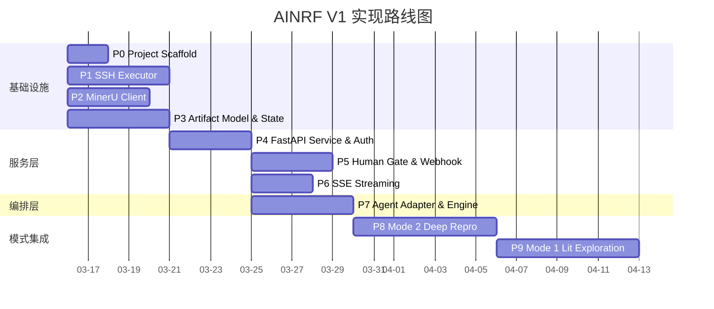
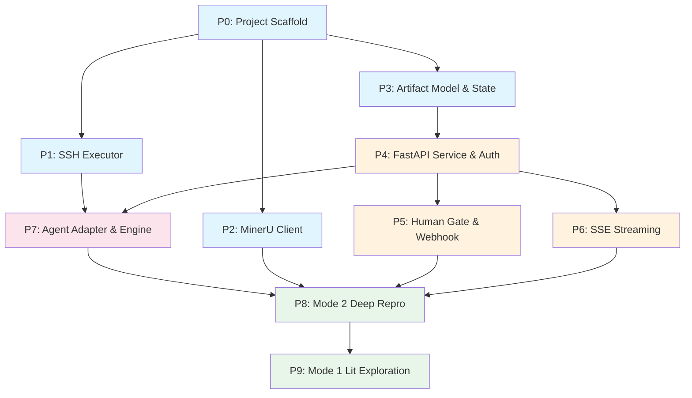

---
aliases:
  - AINRF V1 Roadmap
  - V1 实现路线图
tags:
  - research-agent
  - framework-design
  - v1-spec
  - roadmap
source_repo: scholar-agent
source_path: /home/xuyang/code/scholar-agent
last_local_commit: workspace aggregate
---
# AINRF V1 Roadmap：实现路线图

> [!abstract]
> 分阶段实现计划，每阶段有明确交付物和可测试标准。总体原则：infrastructure first → Mode 2（更可控）→ Mode 1（更开放）。基础设施阶段（P0-P6）可大量并行；Mode 2（P8）整合全部基础设施；Mode 1（P9）在 Mode 2 之上叠加探索能力。

## Overview

> [!tip]
> 下图展示各阶段的时序关系。P0-P3 无依赖可并行启动；P4 依赖 P3 的工件模型；P5/P6 依赖 P4 的 API 骨架；P7 整合执行器与 API；P8/P9 是两种模式的端到端集成。

## P0: Project Scaffold

> [!info]
> 最小骨架，确保后续所有阶段有统一的包结构和入口点。

**交付物：**

- `src/ainrf/` 包结构：`__init__.py`、`__main__.py`、`cli.py`
- `pyproject.toml` 更新：添加 `ainrf` 入口点、基础依赖声明（pydantic、fastapi、uvicorn、asyncssh、httpx）
- CLI 入口：基于 `click` 或 `typer`，支持 `ainrf --help`、`ainrf serve`、`ainrf run` 子命令骨架
- 基础日志配置：structlog + JSON 格式，统一全项目日志规范
- CI 骨架：pre-commit hooks（ruff lint + format）、基础 pytest 配置

**可测试标准：**

- `uv run ainrf --help` 正常输出帮助信息
- `uv run ainrf --version` 输出版本号
- `uv run pytest tests/` 通过（即使只有一个 placeholder test）
- `ruff check src/ainrf/` 零错误

**依赖：** 无——这是所有阶段的起点。

**风险：** 低。唯一需要决策的是 CLI 框架选择（typer vs click），建议用 typer 以减少样板代码。

## P1: SSH Executor & Container Bootstrap

> [!info]
> 框架的执行平面运行在隔离容器上（详见 [[framework/container-workspace-protocol]]）。本阶段交付从宿主到容器的完整连接与命令执行能力。

> [!note]
> 当前实现默认项：
> - 仅支持 `Ubuntu/Debian + bash`
> - 仅实现 `asyncssh` 路径，不做 `paramiko` fallback
> - 环境变量入口使用 `AINRF_CONTAINER_*`
> - 默认验收是离线 `pytest` 契约测试 + 真实容器手工 smoke，不把外部容器接入默认测试

**交付物：**

- `SSHExecutor` 类：管理 SSH 连接池、支持连接复用和自动重连
- 命令执行接口：`run_command(cmd, timeout, cwd)` → `CommandResult(exit_code, stdout, stderr)`
- 文件传输接口：`upload(local, remote)` / `download(remote, local)`，基于 SFTP
- Claude Code 自动检测与安装：连接后检测容器上是否已安装 CC CLI，未安装则自动执行安装脚本
- 连接配置：从 `~/.ssh/config` 或环境变量读取，支持密钥认证和跳板机
- 健康检查：`ping()` 方法验证连接可用性、GPU 可见性、磁盘空间

**可测试标准：**

- 连接到测试容器 → 执行 `echo hello` → 返回 `hello`
- 检测容器上无 CC → 自动安装 → 验证 `claude --version` 可用
- 上传本地文件到容器 → 下载回来 → 内容一致
- 连接断开后自动重连 → 再次执行命令成功
- 健康检查返回 GPU 型号、CUDA 版本、可用磁盘空间

**依赖：** P0（需要包结构）

**风险：**

| 风险 | 影响 | 缓解策略 |
| --- | --- | --- |
| SSH 库选择：paramiko vs asyncssh | asyncssh 原生 async 但生态较小；paramiko 成熟但同步 | 选 asyncssh，框架整体基于 asyncio；paramiko 作为 fallback |
| 容器网络不稳定导致连接中断 | 长时间任务执行失败 | 指数退避重连 + 命令级幂等设计 + nohup 包装长任务 |
| CC 安装脚本在不同 OS 上行为不一致 | 自动安装失败 | 预定义支持的 OS 列表，不支持的抛明确错误 |

## P2: MinerU Client

> [!info]
> MinerU Cloud API 是论文 PDF → Markdown 的唯一入口。本阶段交付独立的 API 客户端，不依赖其他模块。

> [!note]
> 结合当前仓库已落地的 CLI 与 `execution` 模块骨架，P2 的具体实施规划见 [[LLM-Working/p2-mineru-implementation-plan]]。

**交付物：**

- `MinerUClient` 类：封装 MinerU Cloud API 的完整调用流程
- PDF 提交接口：`submit_pdf(pdf_path) → task_id`
- 轮询与结果获取：`poll_result(task_id) → ParseResult(markdown, figures, metadata)`
- 结构验证：检查返回的 Markdown 是否包含标题、摘要、正文等必要结构
- 错误处理：API 限流重试、解析失败分类（PDF 损坏 / 结构无法提取 / API 超时）
- 本地缓存：相同 PDF（按 SHA256）不重复提交

**可测试标准：**

- 提交一份已知结构良好的 PDF → 获取 Markdown → 包含标题、摘要、至少 3 个 section
- 提交一份损坏的 PDF → 返回明确的 `ParseFailure` 而非未处理异常
- 重复提交同一 PDF → 命中本地缓存，不发起 API 调用
- API 限流场景 → 自动重试 → 最终成功或返回 `RateLimitExhausted`

**依赖：** 无——完全独立模块，可与 P0/P1/P3 并行开发。

**风险：**

| 风险 | 影响 | 缓解策略 |
| --- | --- | --- |
| MinerU API 不可用或变更 | 论文解析完全阻塞 | 定义 `PaperParser` 抽象接口，MinerU 作为默认实现；预留本地 fallback（如 marker） |
| 复杂 PDF（双栏、大量公式）解析质量差 | PaperCard 信息不完整 | 解析后自动质量评分，低于阈值标记为 `partial_parse`，不阻塞流程 |
| API 费用超预期 | 预算消耗过快 | 客户端内置调用计数和费用估算，接近预算时告警 |

## P3: Artifact Model & State Store

> [!info]
> 工件模型是整个框架的核心数据结构（详见 [[framework/artifact-graph-architecture]]）。本阶段把设计文档中的一等工件转化为可运行的 Pydantic models 和状态机。
>
> 结合当前仓库已落地的 `execution` / `parsing` 模块边界与本地状态约束，P3 的具体实施规划见 [[LLM-Working/p3-artifact-state-store-implementation-plan]]。

**交付物：**

- 全部一等工件的 Pydantic v2 models：`PaperCard`、`ReproductionTask`、`ExperimentRun`、`EvidenceRecord`、`Claim`、`ExplorationGraph`、`QualityAssessment`、`WorkspaceManifest`、`HumanGate`、`AgentAdapter`
- 状态机实现：每个有生命周期的工件（PaperCard、ReproductionTask、ExperimentRun、HumanGate）定义合法状态转换，非法转换抛 `InvalidTransitionError`
- `StateStore` 接口与 JSON 实现：`save(artifact)`、`load(artifact_type, id)`、`query(artifact_type, filters)`
- Checkpoint/Resume：`checkpoint()` 序列化全部活跃工件到 JSON 文件；`resume(checkpoint_path)` 恢复状态
- 工件关系索引：维护工件间的引用关系（如 PaperCard → ReproductionTask → ExperimentRun）

**可测试标准：**

- 创建 `PaperCard(status="captured")` → 转换到 `structured` → 成功
- 尝试 `PaperCard(status="captured")` → 直接转换到 `completed` → 抛 `InvalidTransitionError`
- `save()` 一组工件 → 关闭进程 → `load()` 恢复 → 所有字段一致
- `checkpoint()` → 修改工件状态 → `resume()` → 状态回到 checkpoint 时刻
- 创建 PaperCard → 关联 ReproductionTask → 查询 PaperCard 的下游工件 → 返回该 ReproductionTask

**依赖：** 无——纯数据模型，可与 P0/P1/P2 并行开发。

**风险：**

| 风险 | 影响 | 缓解策略 |
| --- | --- | --- |
| 工件 schema 在后续阶段频繁变更 | 已持久化的 JSON 与新 schema 不兼容 | 每个工件带 `schema_version` 字段 + 编写迁移函数 |
| JSON 文件在并发写入时损坏 | 状态丢失 | 写入使用 atomic write（先写临时文件再 rename）+ 文件锁 |
| 状态机复杂度随工件增多而膨胀 | 维护困难 | 用声明式状态转换表而非 if-else，状态图可自动生成文档 |

## P4: FastAPI Service & Auth

> [!info]
> FastAPI 服务是框架的对外接口层（详见 [[framework/v1-rfc]]）。本阶段交付 API 骨架、认证和所有端点的 request/response models。
>
> 结合当前仓库已落地的 `execution`、`artifacts`、`state` 模块边界与本地 daemon 约束，P4 的具体实施规划见 [[LLM-Working/p4-fastapi-service-auth-implementation-plan]]。

**交付物：**

- FastAPI 应用骨架：`ainrf.api` 模块，含 `app.py`、`routes/`、`middleware/`、`schemas/`
- 认证中间件：API Key 认证，从 header `X-API-Key` 读取，支持多 key 管理
- 核心端点（request/response models 完整，业务逻辑可为 stub）：
  - `POST /tasks` — 创建研究任务（Mode 1 或 Mode 2）
  - `GET /tasks/{id}` — 查询任务状态与工件摘要
  - `POST /tasks/{id}/cancel` — 取消运行中的任务
  - `GET /tasks/{id}/artifacts` — 获取任务关联的所有工件
  - `GET /health` — 服务健康检查
- Daemon 启动模式：`ainrf serve --port 8000 --daemon` 后台运行
- OpenAPI schema 自动生成，包含完整的类型定义和示例

**可测试标准：**

- 无 API Key 请求任意端点 → 401 Unauthorized
- 无效 API Key → 401
- 有效 Key + `POST /tasks` 合法 body → 201 Created + 返回 task_id
- 有效 Key + `GET /tasks/{id}` → 200 + 任务状态 JSON
- `GET /health` → 200 + `{"status": "ok"}`
- `GET /openapi.json` → 完整 OpenAPI schema，所有端点和 model 均有定义
- `ainrf serve --daemon` → 进程后台运行 → `curl /health` 成功

**依赖：** P3（API 的 request/response models 基于工件 Pydantic models）

**风险：**

| 风险 | 影响 | 缓解策略 |
| --- | --- | --- |
| API 设计在集成阶段需要大幅调整 | 前端/客户端代码返工 | 先定义 OpenAPI spec，用 spec-first 方式开发；版本化 API（`/v1/`） |
| Daemon 模式下日志丢失 | 问题难以排查 | 日志写文件 + 支持 `--log-file` 参数；structlog JSON 格式 |

## P5: Human Gate & Webhook

> [!info]
> 人工关卡是有界自治的核心机制（详见 [[framework/ai-native-research-framework]] 和 [[framework/v1-dual-mode-research-engine]]）。V1 保留两个显式关卡：纳入关卡和计划关卡。
>
> 结合当前仓库已落地的 P4 task-scoped 路由、`HumanGate` artifact 与本地 state read model，P5 的具体实施规划见 [[LLM-Working/p5-human-gate-webhook-implementation-plan]]。

**交付物：**

- `HumanGateManager` 类：管理关卡的创建、等待、审批/拒绝生命周期
- 关卡类型：`intake`（纳入关卡）和 `plan_approval`（计划关卡），各有专属的 payload schema
- Webhook 发送：关卡触发时向配置的 URL 发送 POST 请求，包含关卡详情和审批链接
- 审批端点：
  - `POST /tasks/{id}/approve` — 审批当前 waiting gate
  - `POST /tasks/{id}/reject` — 拒绝当前 waiting gate，并可附带反馈
  - `GET /tasks?status=gate_waiting` — 列出所有待审批任务
- Yolo 模式旁路：配置 `yolo: true` 时自动批准所有关卡，用于测试和信任场景
- 超时处理：关卡超过配置时间未审批 → 自动暂停任务 + 发送提醒 webhook
**可测试标准：**

- 任务到达纳入关卡 → webhook POST 发出 → 包含 gate_id 和 payload
- `POST /tasks/{id}/approve` → 当前 waiting gate 变为 `approved` → 任务继续执行
- `POST /tasks/{id}/reject` → 当前 waiting gate 变为 `rejected` → 任务按 gate 语义回退或终止
- Yolo 模式开启 → 关卡创建后立即自动批准 → 不发送 webhook → 任务无阻塞
- 关卡超时 → 任务暂停 → 提醒 webhook 发出 → 人工审批后恢复

**依赖：** P3（HumanGate 工件模型）、P4（API 端点挂载）

**风险：**

| 风险 | 影响 | 缓解策略 |
| --- | --- | --- |
| Webhook 目标不可达 | 人无法收到审批通知 | 重试 3 次 + 指数退避；支持多 webhook URL；失败后记录到日志供轮询发现 |
| Yolo 模式误用于生产 | 跳过关键审批 | 启动时 yolo 模式打印醒目警告；API 响应中标注 `auto_approved: true` |

## P6: SSE Streaming

> [!info]
> Server-Sent Events 提供任务执行的实时可观测性。客户端（CLI、Web UI、webhook consumer）通过 SSE 订阅任务事件流。

**交付物：**

- SSE 端点：`GET /tasks/{id}/events`，返回 `text/event-stream`
- 事件类型定义：
  - `task.started` / `task.completed` / `task.failed` / `task.cancelled`
  - `artifact.created` / `artifact.updated` — 工件生命周期事件
  - `gate.pending` / `gate.resolved` — 人工关卡事件
  - `experiment.started` / `experiment.completed` — 实验执行事件
  - `log.info` / `log.warning` / `log.error` — 结构化日志事件
- 事件持久化：所有事件写入 append-only 的 JSON Lines 文件
- 断线重连：客户端通过 `Last-Event-ID` header 从断点恢复
- 事件过滤：`?types=artifact,gate` 参数只订阅指定类型
**可测试标准：**

- 连接 `GET /tasks/{id}/events` → 触发任务 → 收到 `task.started` 事件
- 工件状态变更 → SSE 推送 `artifact.updated` 事件 → 包含工件 ID 和新状态
- 断开连接 → 重连并携带 `Last-Event-ID` → 从断点继续接收，不丢失事件
- `?types=gate` 过滤 → 只收到 `gate.*` 事件，不收到 `artifact.*` 事件
- 任务完成后连接 → 收到完整历史事件回放 + `task.completed` 终止事件

**依赖：** P4（SSE 端点挂载在 FastAPI 服务上）

**风险：**

| 风险 | 影响 | 缓解策略 |
| --- | --- | --- |
| 长连接占用服务器资源 | 并发任务多时连接数爆炸 | 设置最大连接数 + 空闲超时断开 + 客户端自动重连 |
| 事件积压导致内存增长 | 服务 OOM | 事件持久化到文件而非内存队列；SSE 从文件读取 |

## P7: Agent Adapter & Task Engine

> [!info]
> Adapter 是宿主无关设计的关键抽象（详见 [[framework/artifact-graph-architecture]]）。TaskEngine 是编排核心，驱动工件状态机并通过 Adapter 在容器上执行原子研究动作。

**交付物：**

- `AgentAdapter` 抽象基类：定义宿主无关的研究动作接口
  - `ingest_paper(pdf_path) → PaperCard`
  - `plan_reproduction(paper_card) → ReproductionTask`
  - `implement_from_paper(task) → CodeArtifact`
  - `run_experiment(config) → ExperimentRun`
  - `analyze_deviation(expected, actual) → EvidenceRecord`
- `ClaudeCodeAdapter` 实现：基于 `claude_code_sdk`，通过 SSH 在容器上调用 CC 执行研究动作
  - 每个动作映射为一次 CC 会话，带有结构化 system prompt 和工具约束
  - 结果解析：从 CC 输出中提取结构化工件数据
- `TaskEngine` 编排器：
  - 接收任务请求 → 初始化工件 → 按工作流驱动状态转换
  - 在每个状态转换点检查人工关卡、预算边界、终止条件
  - 发射 SSE 事件 → 持久化状态 → 处理失败与重试
  - 支持 checkpoint/resume：任意时刻可暂停，重启后从最近 checkpoint 恢复
**可测试标准：**

- 提交任务 → TaskEngine 创建 PaperCard → 状态从 `captured` 转到 `structured` → SSE 事件发出
- TaskEngine 到达 HumanGate → 暂停 → approve → 继续执行下一步
- 通过 ClaudeCodeAdapter 在容器上执行 `echo "test"` → 返回结果 → 解析成功
- TaskEngine 执行中 kill 进程 → 重启 → `resume()` → 从最近 checkpoint 继续
- 预算耗尽 → TaskEngine 自动终止 → 记录终止原因 → 发射 `task.cancelled` 事件

**依赖：** P1（SSH 执行器）、P3（工件模型）、P4（API 集成）

**风险：**

| 风险 | 影响 | 缓解策略 |
| --- | --- | --- |
| CC SDK API 变更或不稳定 | Adapter 调用失败 | 锁定 SDK 版本 + Adapter 内部做版本兼容层 + 集成测试覆盖 |
| CC 会话超时或输出格式不可预测 | 工件解析失败 | 结构化 prompt 约束输出格式 + 解析失败时重试一次 + 降级为原始文本记录 |
| TaskEngine 状态机与实际执行不同步 | 工件状态不一致 | 每步执行后立即持久化 + 状态转换前校验前置条件 |

## P8: Mode 2 — Deep Reproduction Pipeline

> [!info]
> Mode 2 是更可控的模式——给定单篇论文，从零实现并高精度复现。本阶段整合 P1-P7 全部基础设施，交付端到端的深度复现能力。详见 [[framework/v1-dual-mode-research-engine]] 中 Mode 2 工作流定义。

**交付物：**

- 论文解析与结构化：PDF → MinerU → Markdown → PaperCard（含方法摘要、关键 claim、目标表格）
- 复现计划生成：agent 分析 PaperCard → 生成 ReproductionTask（`implement-from-paper` 策略）
  - 计划包含：实现范围、目标表格、预估工作量、依赖清单、成功标准
- 从零实现：agent 在容器上按计划实现论文核心方法
  - 代码组织遵循 [[framework/container-workspace-protocol]] 的 `src/` 目录约定
  - 实现过程中持续 git commit，保持可审计性
- 实验执行：按论文实验设置运行 baseline → per-table 复现
- 偏差分析：论文报告值 vs 复现值的定量对比 + 根因诊断
- QualityAssessment 生成：汇聚所有 EvidenceRecord → 产出含金量、可复现性、方法科学性的结构化评估
**可测试标准：**

- 提交一篇无开源代码的论文 PDF → 端到端产出 QualityAssessment
- PaperCard 包含至少：标题、方法摘要、3+ 关键 claim、目标表格列表
- 复现计划经 HumanGate 审批后 → agent 在容器上自主实现 → `src/` 目录包含可运行代码
- 实验执行产出 `ExperimentRun`，含 config、logs、metrics、result.json
- 偏差分析对每个目标表格给出：论文值、复现值、偏差百分比、根因假设
- QualityAssessment 三个维度（含金量、可复现性、方法科学性）均有评分和证据引用
- 复现失败（方法描述不充分）→ ReproductionTask 状态为 `blocked` → 附带具体卡点说明

**依赖：** P1-P7 全部

**风险：**

| 风险 | 影响 | 缓解策略 |
| --- | --- | --- |
| 论文方法描述不充分，无法从零实现 | 复现任务阻塞 | 这是预期的正式输出——记录为 `blocked` 状态 + 具体卡点分析，本身是有价值的 QualityAssessment 输入 |
| 实验结果与论文偏差过大 | 无法判断是实现错误还是论文问题 | 分阶段验证：先 baseline → 再完整表格；偏差超阈值时触发诊断循环（最多 3 轮） |
| GPU 资源不足或训练时间过长 | 预算耗尽 | 计划阶段预估资源需求；TaskEngine 持续监控预算；支持 `core-only` 范围缩减 |
| 数据集不可获取 | 实验无法运行 | 计划阶段明确数据来源；数据不可用时记录为 `env_failure` 而非系统错误 |

## P9: Mode 1 — Literature Exploration Pipeline

> [!info]
> Mode 1 是更开放的模式——从种子论文出发递归探索文献网络。本阶段在 Mode 2 复现能力之上叠加探索、排序和终止控制。详见 [[framework/v1-dual-mode-research-engine]] 中 Mode 1 工作流定义。

**交付物：**

- ExplorationGraph 管理：初始化、更新前沿状态、记录已访问/排队/剪枝的 PaperCard
- 参考文献提取与排序：从 PaperCard 中提取引用 → 按相关性和复现价值排序
  - 排序信号：被引次数（如可获取）、与种子论文的方法相关性、agent 评估的复现价值
- 选择性复现：对高价值论文触发 ReproductionTask（复用 P8 的 Mode 2 能力）
- 终止控制器：三重终止条件——
  - 递归深度达到上限（如 3 跳）
  - 预算耗尽（GPU 小时、API 费用、总时长）
  - agent 自评递减收益（连续 N 篇论文未产出新的高价值 claim）
- 探索报告生成：汇总 ExplorationGraph → 产出核心发现、文献地图、下一步建议
**可测试标准：**

- 提交种子论文 → 系统自主探索 → 在深度上限（如 2 跳）内终止 → 产出 ExplorationGraph
- ExplorationGraph 包含：已访问 PaperCard 列表、排队论文、剪枝论文及原因、当前深度
- 至少一篇高价值论文触发 ReproductionTask → 产出复现结果
- 递减收益检测：连续 3 篇论文无新 claim → 自动终止 → 终止原因记录在 ExplorationGraph
- 预算耗尽 → 探索终止 → 报告中说明已探索范围和未探索前沿
- 探索报告包含：核心发现摘要、文献关系图、复现结果汇总、下一步建议
- 解析失败的论文 → 记录为 `EvidenceRecord(type=parse_failure)` → 不阻塞探索继续

**依赖：** P1-P7 全部 + P8（复现能力复用）

**风险：**

| 风险 | 影响 | 缓解策略 |
| --- | --- | --- |
| 参考文献 PDF 无法获取 | 探索链断裂 | 记录为 `unavailable` → 跳过 → 尝试下一篇；不阻塞整体探索 |
| 探索空间爆炸（每篇论文引用 30+ 篇） | 预算快速耗尽 | 严格的排序和剪枝策略；每层最多展开 top-K 篇（K 可配置） |
| 递减收益判断不准确 | 过早终止或过晚终止 | 多信号融合（claim 新颖度 + 方法差异度 + 用户指定的关注方向）；终止前生成"即将终止"事件供人干预 |
| 循环引用导致无限探索 | 系统不终止 | ExplorationGraph 维护已访问集合，重复论文直接跳过 |

## Phase Dependencies

> [!tip]
> 下图展示所有阶段的依赖关系。箭头表示"必须先完成"。无入边的节点可并行启动。

## Risk Register

> [!warning]
> 跨阶段的系统性风险汇总。各阶段内部风险见对应章节。

| 风险类别 | 具体风险 | 影响范围 | 概率 | 缓解策略 |
| --- | --- | --- | --- | --- |
| 基础设施 | SSH 连接不稳定，长任务中断 | P1, P7, P8, P9 | 中 | 指数退避重连 + nohup 包装 + checkpoint/resume |
| 外部依赖 | MinerU Cloud API 不可用或变更 | P2, P8, P9 | 低 | 抽象 `PaperParser` 接口 + 本地 fallback（marker） |
| 外部依赖 | Claude Code SDK 版本不兼容 | P7, P8, P9 | 中 | 锁定版本 + Adapter 兼容层 + 集成测试 |
| 数据一致性 | 长时间任务中状态持久化失败 | P3, P7 | 低 | atomic write + 文件锁 + 每步持久化 + checkpoint |
| 资源 | GPU 资源不足或训练超时 | P8, P9 | 高 | 计划阶段预估 + 持续预算监控 + `core-only` 降级 |
| 设计 | 工件 schema 频繁变更 | P3, P4 | 中 | `schema_version` 字段 + 迁移函数 + 向后兼容策略 |
| 集成 | P8/P9 集成时发现基础设施层缺陷 | 全部 | 中 | 每个基础设施阶段交付时编写集成 smoke test |
| 运维 | 服务长时间运行后内存泄漏 | P4, P6 | 低 | 事件持久化到文件 + 连接超时回收 + 定期健康检查 |

**总体缓解原则：**

- 每个阶段交付时必须通过该阶段的全部可测试标准，不允许"先跳过后补"。
- P8 集成前，P1-P7 各自的 smoke test 必须在真实容器环境上通过一次。
- 所有外部依赖（MinerU、CC SDK、asyncssh）锁定具体版本，升级需经过集成测试。

## 关联笔记

- [[framework/index]]
- [[framework/ai-native-research-framework]]
- [[framework/artifact-graph-architecture]]
- [[framework/v1-dual-mode-research-engine]]
- [[framework/container-workspace-protocol]]
- [[framework/reference-mapping]]
- [[framework/v1-rfc]]
