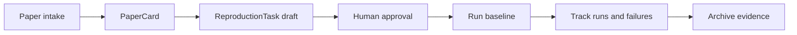

---
aliases:
  - 半自动研究副驾 V1
tags:
  - research-agent
  - framework-design
  - v1-spec
source_repo: scholar-agent
source_path: /home/xuyang/code/scholar-agent
last_local_commit: workspace aggregate
---
# V1：半自动研究副驾

> [!abstract]
> V1 不追求全自动科研闭环，而是优先把“读论文 → 方法级复现 → 实验追踪”做成一个稳定、可审计、对 agent 友好的主工作流。人在关键节点审批，agent 负责信息组织、计划生成、执行编排和结果归档。

## V1 目标

- 把论文阅读从自由文本总结升级为结构化 `PaperCard`。
- 把复现从“一次性跑脚本”升级为可跟踪的 `ReproductionTask`。
- 把实验从零散命令历史升级为正式 `ExperimentRun` 账本。
- 为后续写作模块留下标准化输入，而不是直接在 V1 里追求投稿级成稿。

## 输入与输出

- 输入：论文 PDF 或链接、代码仓库、复现目标、资源约束、人工备注。
- 输出：结构化阅读卡、复现计划、实验运行记录、偏差说明、可归档证据。
- 一个关键约束是：V1 输出必须被后续 agent 或人类研究者直接复用，而不是只能在当前会话里阅读。

## 主工作流

## 工作流细化

- Paper intake：抽取问题、方法、依赖、主要 claim、作者给出的复现线索。
- 复现计划：明确代码入口、环境前置条件、最小可运行 baseline、成功标准和停止条件。
- 实验执行：先跑通 baseline，再视结果决定是否进入参数扫描、消融或资源扩展。
- 结果归档：把成功 run、失败 run 和原因分析一并记录，避免只保留“好看的结果”。

## 人工关卡

- 纳入关卡：人决定哪些论文值得进入复现流程。
- 计划关卡：人确认复现目标是否合理，避免 agent 自行扩大任务范围。
- 预算关卡：需要额外 GPU、远程机器或更长运行时间时，必须停下来确认。
- 归档关卡：决定哪些结论可提升为正式 `Claim`，哪些仍只是临时观察。

## V1 Done 定义

- 研究者可以从一篇论文稳定地产出 `PaperCard`、`ReproductionTask` 和至少一个 `ExperimentRun`。
- 失败 run 不会丢失，且能区分是环境问题、代码问题还是结果偏差问题。
- 不同宿主接入时，核心对象和状态定义保持一致，不重写业务语义。
- 文档层能明确说明 V1 如何向未来的写作系统和更强自动化系统交接。

## 明确不做

- 不承诺 V1 自动接近论文主表结果。
- 不把写作、review、rebuttal 作为一等主环。
- 不把 nightly autonomy 作为成败标准。

## 关联笔记

- [[framework/index]]
- [[framework/ai-native-research-framework]]
- [[framework/artifact-graph-architecture]]
- [[framework/reference-mapping]]
- [[projects/auto-claude-code-research-in-sleep]]
