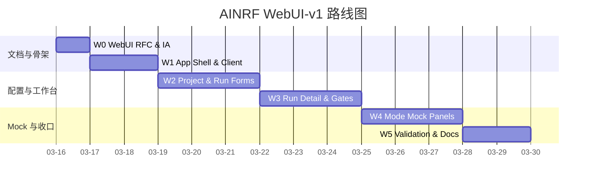

---
aliases:
  - AINRF WebUI V1 Roadmap
  - WebUI-v1 路线图
tags:
  - research-agent
  - framework-design
  - webui
  - gradio
  - roadmap
source_repo: scholar-agent
source_path: /home/xuyang/code/scholar-agent
last_local_commit: workspace aggregate
---
# AINRF WebUI-v1 Roadmap：项目工作台实现路线图

> [!abstract]
> WebUI-v1 以独立轨道推进，不改写核心 P0-P9 主线。它建立在现有 FastAPI、Human Gate、SSE 和状态存储之上，先交付可操作的项目工作台，再逐步把 mock 模式替换为真实 Mode 1 / Mode 2 执行链路。

## Overview

> [!tip]
> WebUI-v1 的依赖核心是 P4-P6 已有接口，以及 P7 对启动入口的稳定化。由于 P8/P9 尚未实现，Mode 页面先以 interactive mock 为主。

## W0: WebUI RFC & Information Architecture

**交付物：**

- `[[framework/webui-v1-rfc]]`
- `[[framework/webui-v1-roadmap]]`
- 主 RFC、主 roadmap、framework index 的最小回链
- Project / Run / MockMode 的信息架构与配置分层决策

**可测试标准：**

- 文档明确 Project 只是 UI 组织层，不是后端资源
- 文档明确 Gradio + API client 边界
- 文档明确 P1-P7 配置覆盖方式与 P8/P9 mock 边界

**依赖：** 无

## W1: App Shell & API Client

> [!note]
> 具体实施规划见 [[LLM-Working/w1-webui-shell-client-implementation-plan]]。

**交付物：**

- `src/ainrf/webui/` 包骨架
- `ainrf webui` 启动入口
- Gradio app shell 与导航框架
- 面向现有 FastAPI 的 typed client 封装
- 健康检查与 API 连通性探测

**可测试标准：**

- `ainrf webui` 能启动本地界面
- API 配置错误时，界面能给出明确错误状态
- 健康检查能显示服务可达 / 不可达 / degraded

**依赖：** P4、P6

**风险：**

| 风险 | 影响 | 缓解策略 |
| --- | --- | --- |
| Gradio 与现有 CLI 入口耦合不清 | 启动方式混乱 | 单独新增 `ainrf webui`，避免塞进 `serve` |
| API 契约继续演进 | client 容易反复返工 | 先对齐现有 `schemas.py`，保持 client 层集中收口 |

## W2: Project & Run Forms

> [!note]
> 具体实施规划见 [[LLM-Working/w2-project-run-forms-implementation-plan]]。

**交付物：**

- Project List 与 Project Detail 两级视图
- Project 默认配置表单
- Run 创建表单，覆盖 P1-P7 对应配置项
- Project 默认值 -> Run 覆盖值 -> `TaskCreateRequest` 的映射逻辑

**可测试标准：**

- 可以创建、编辑、读取 Project 默认配置
- Mode 1 / Mode 2 能生成不同的 run 表单
- 表单提交时能构造合法 `POST /tasks` 请求

**依赖：** W1、P4、P5

## W3: Run Detail, Gates & Event Timeline

> [!note]
> 具体实施规划见 [[LLM-Working/w3-run-detail-gates-events-implementation-plan]]。

**交付物：**

- Run Detail 页面
- gate waiting / resolved 状态展示
- approve / reject UI 操作
- artifact 摘要和事件时间线视图
- SSE 优先、轮询降级的观察面

**可测试标准：**

- 对真实 waiting gate，界面可触发 approve / reject
- 对终态 run，可稳定回放历史事件
- SSE 不可用时，轮询降级不改变主要页面结构

**依赖：** W2、P5、P6

## W4: Mode 1 / Mode 2 Interactive Mock

**交付物：**

- Mode 1 mock 面板：需求澄清、候选论文池、方法脉络、占位图谱、发现卡片与 idea 方向
- Mode 2 mock 面板：实现阶段、baseline、目标表格、偏差分析、质量评估
- mock data adapter，与真实 API client 分层隔离
- mock / real 数据源的显式标识

**可测试标准：**

- 未实现的 mode 能完整走通创建 -> 详情 -> 占位推进 -> 结束态
- mock 状态不会污染真实 task payload
- 页面能稳定呈现成功、等待审批、失败三类占位结果

**依赖：** W3、P7

## W5: Validation, Demo Readiness & Documentation

**交付物：**

- smoke tests：启动、表单映射、API client 错误处理、mock flow
- WebUI 使用说明和演示路径
- 与主 RFC/roadmap 的最终回链
- `LLM-Working` 实施/复盘文档

**可测试标准：**

- 关键 happy path 和降级路径均有 smoke coverage
- 文档明确区分真实能力与 mock 能力
- 演示时能够从 Project 进入 Run 并完成一次审批或 mock 完成流程

**依赖：** W4

## Cross-Cutting Risks

| 风险类别 | 具体风险 | 影响范围 | 概率 | 缓解策略 |
| --- | --- | --- | --- | --- |
| 产品边界 | Project 与 task 边界不清，导致 UI 假设固化错误 | W2-W5 | 中 | 在 RFC 中把 Project 明确限制为 UI 组织层 |
| 前后端契约 | 现有 task API 无法覆盖全部 UI 预期字段 | W1-W3 | 中 | 先以现有接口为准，额外字段只停留在 UI 本地状态 |
| 技术选型 | Gradio 对复杂工作台支持有限 | W1-W4 | 中 | v1 控制页面数量和状态复杂度，避免过度交互 |
| 能力缺口 | P8/P9 未实现导致演示失真 | W4-W5 | 高 | 用 interactive mock 固定流程，同时显式标记占位能力 |

## Exit Criteria

- WebUI 能作为独立入口启动。
- 至少具备 Project List、Project Detail、Run Detail 三个页面。
- 能通过 UI 创建 run、查看真实 task/gate/event 状态，并在未实现能力处展示明确 mock。
- 文档与实现都不把 UI 内部 `Project` 误写为后端一等对象。

## 关联笔记

- [[framework/index]]
- [[framework/v1-roadmap]]
- [[framework/webui-v1-rfc]]
- [[framework/v1-rfc]]
