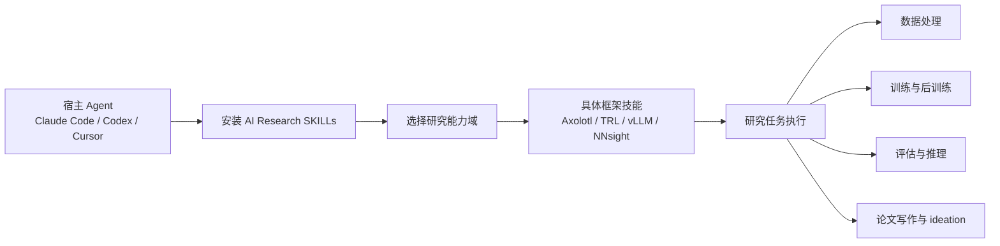

---
aliases:
  - AI Research SKILLs
tags:
  - research-agent
  - repo-study
  - skills-library
source_repo: AI-Research-SKILLs
source_path: /home/xuyang/code/scholar-agent/ref-repos/AI-Research-SKILLs
last_local_commit: 0ae5872 2026-03-05 chore: Bump versions and remove PDF templates
---
# AI Research SKILLs：AI 研究工程技能库

> [!abstract]
> 这是一个“能力层”仓库，不是单一研究 agent。它把 AI 研究工程拆成 21 个类别、85 个技能，目标是把数据准备、训练、评估、部署、论文写作等能力注入任意 coding agent。

## 项目定位

- 核心主张是“the most comprehensive open-source library of AI research engineering skills for AI agents”。
- 设计重点不是固定工作流，而是把研究工程能力模块化，供 Claude Code、Codex、Cursor、Gemini CLI 等宿主复用。
- 从仓库形态看，它更像“研究工程插件市场”而不是“开箱即用的单条研究流水线”。

## 仓库构成

- 顶层按编号目录拆分 21 个能力域，如 `01-model-architecture/`、`06-post-training/`、`14-agents/`、`20-ml-paper-writing/`、`21-research-ideation/`。
- 本地可见 85 个 `SKILL.md`，例如 `litgpt`、`axolotl`、`trl-fine-tuning`、`transformer-lens`、`vllm` 等。
- 还包含 `packages/ai-research-skills/` 和 `package.json`，说明它不仅是文档集合，也是一个可安装分发包。

## 核心工作流

## 研究生命周期覆盖

- 前期：包含 `research-ideation`、`prompt-engineering`、`rag`、`agents` 等，适合做方向探索和工具接入。
- 中段：`fine-tuning`、`distributed-training`、`optimization`、`post-training`、`inference-serving` 构成实验执行主干。
- 后段：`evaluation`、`ml-paper-writing`、`observability`、`mlops` 负责验证、沉淀与交付。
- 特征是“横向广、纵向不强绑定”，研究者需要自己决定如何把技能串成流程。

## 集成与依赖面

- README 提供 `npx @orchestra-research/ai-research-skills` 的交互式安装器，面向多 agent 生态，而非单一 CLI。
- 仓库没有独立 `agents/` 或 `commands/` 主体，说明它依赖外部宿主承担编排、记忆和执行。
- 对已经有稳定 agent harness 的团队更友好，对希望“一条命令跑到底”的用户则不够直接。

## 证据与样例

- 使命、安装方式和 21 类目录来自 [AI-Research-SKILLs/README.md](../../ref-repos/AI-Research-SKILLs/README.md)。
- 技能颗粒度可从 [AI-Research-SKILLs/01-model-architecture](../../ref-repos/AI-Research-SKILLs/01-model-architecture) 和 [AI-Research-SKILLs/06-post-training](../../ref-repos/AI-Research-SKILLs/06-post-training) 直接观察。
- 包分发入口见 [AI-Research-SKILLs/package.json](../../ref-repos/AI-Research-SKILLs/package.json)。
- 本地最近提交为 `0ae5872`，日期 `2026-03-05`。

## 优势

- 覆盖 AI 研究工程全链路，适合作为“研究 agent 能力底座”。
- 技能直接绑定具体框架和工具，而不是停留在泛泛 prompt。
- 多宿主兼容，迁移成本主要落在宿主而不是技能库自身。

## 局限与风险

- 缺少统一编排层，落地质量高度依赖宿主 agent 的规划与执行能力。
- 过于强调 breadth，单个技能之间是否能无缝组合需要用户自己验证。
- 对纯学术写作或论文修改场景并不够聚焦。

## 适用场景

- 已经有 Claude Code、Codex 或 Cursor 使用习惯，希望补齐研究工程能力。
- 团队需要建立统一技能资产库，而不是绑定某一个研究 pipeline。
- 想做“研究 agent 平台层”，而不是直接拿一个固定工作流开跑。

## 关联笔记

- [[index]]
- [[summary/academic-research-agents-overview]]
- [[projects/argusbot]]
- [[projects/claude-scholar]]
- [[projects/everything-claude-code]]
- [[projects/academic-research-skills]]
