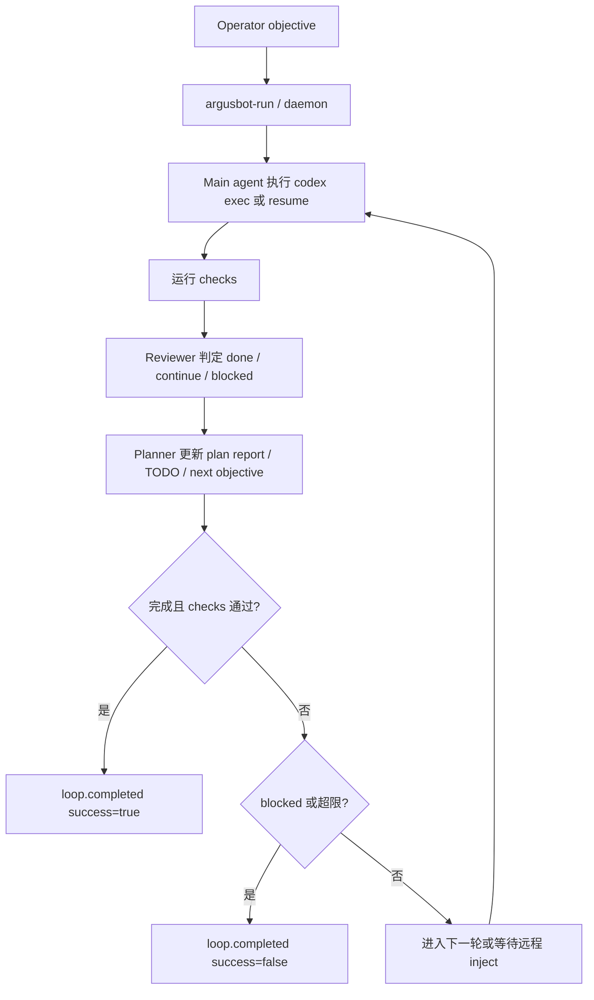

---
aliases:
  - ArgusBot
tags:
  - research-agent
  - repo-study
  - control-plane
source_repo: ArgusBot
source_path: /home/xuyang/code/scholar-agent/ref-repos/ArgusBot
last_local_commit: efcf6e4 2026-03-15 update
---
# ArgusBot：面向 Codex 的监督式 Autoloop 控制层

> [!abstract]
> ArgusBot 不是学术研究内容系统，而是一个围绕 Codex CLI 构建的监督式 autoloop / daemon 控制层。它把主代理、reviewer、planner 和远程控制面组合起来，目标是避免 agent 半途停下并把长任务变成可持续、可干预、可恢复的循环。

## 项目定位

- README 把它定义为 “a Python supervisor plugin for Codex CLI”。
- 核心主张不是“会做研究”，而是让主代理持续执行，由 reviewer 决定 `done` / `continue` / `blocked`，由 planner 维护当前框架视图与下一次 objective。
- 从本目录的比较维度看，它更接近“控制层参考”而不是“研究流水线”或“学术写作系统”。

## 仓库构成

- Python 包主体位于 `codex_autoloop/`，同时包含 `core/`、`adapters/`、`apps/` 三层结构和一批兼容包装模块。
- CLI 入口完整：`argusbot`、`argusbot-run`、`argusbot-daemon`、`argusbot-daemon-ctl`、`argusbot-setup`、`argusbot-models` 都已在 `pyproject.toml` 中注册。
- 还有 `skills/`、`tests/`、Feishu/Telegram 文档和 dashboard/daemon 相关脚本，说明它不是单个 prompt，而是一套可运行的监督控制系统。

## 核心工作流

## 研究生命周期覆盖

- 前期不提供研究 ideation、文献综述或 citation synthesis 本身；这些能力需要由被监督的 Codex 工作区自己实现。
- 中期价值最大：它能把实现、调试、实验执行和验证包进 reviewer-gated 循环，并支持 `--check`、resume、stall watchdog。
- 后期也不负责论文写作或投稿工艺，但能通过 planner 把下一步 objective、TODO 板和 run archive 保留下来。
- 因此它覆盖的是“执行控制与会话持续性”，不是“研究内容生产全流程”。

## 集成与依赖面

- 强绑定 Codex CLI，但支持 Telegram、Feishu、本地 dashboard、terminal bus 等多种操作面。
- daemon 模式下默认使用 `--yolo`，README 明确提示安全与成本风险，这说明它偏向高自治熟手用户。
- 还能通过本地 `copilot-proxy` 路由模型调用，说明它把模型供应层也当成运行时控制问题来处理。

## 证据与样例

- 项目定位、默认行为、daemon 与控制命令见 [ArgusBot/README.md](../../ref-repos/ArgusBot/README.md)。
- 端到端事件流和停止条件见 [ArgusBot/PIPELINE.md](../../ref-repos/ArgusBot/PIPELINE.md)。
- 分层架构见 [ArgusBot/ARCHITECTURE.md](../../ref-repos/ArgusBot/ARCHITECTURE.md)。
- CLI script 入口见 [ArgusBot/pyproject.toml](../../ref-repos/ArgusBot/pyproject.toml)。
- 监督循环和 planner 技能见 [ArgusBot/skills](../../ref-repos/ArgusBot/skills)。
- 测试覆盖面可从 [ArgusBot/tests](../../ref-repos/ArgusBot/tests) 直接观察。
- 本地最近提交为 `efcf6e4`，日期 `2026-03-15`。

## 优势

- reviewer 和 planner 都是显式一等角色，适合约束“主代理跑一半就停”的问题。
- daemon、远程控制、session resume、plan snapshot 这些运行面做得比多数研究仓库更完整。
- 测试目录和架构文档同时存在，说明它不只是概念包装，而是有工程化控制层意识。

## 局限与风险

- 不自带深研究、学术写作或文献管理能力，必须依附目标工作区和外部技能体系。
- 对 Codex 生态绑定深，迁移到其他宿主时不能直接照搬。
- `--yolo` 默认值和长循环模式会放大安全、成本和错误放大风险。

## 适用场景

- 需要让 Codex 在本地项目里持续执行长任务，并通过 reviewer gate 决定是否继续。
- 需要 Telegram/Feishu/terminal 远程干预运行中的 agent，而不是只在本机盯终端。
- 已经有研究或工程任务能力，但缺少一层可恢复、可监督、可留痕的控制面。

## 关联笔记

- [[index]]
- [[summary/academic-research-agents-overview]]
- [[framework/reference-mapping]]
- [[projects/auto-claude-code-research-in-sleep]]
- [[projects/claude-scholar]]
- [[projects/everything-claude-code]]
