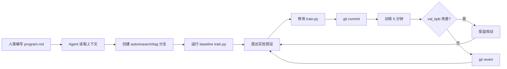

---
aliases:
  - autoresearch
  - Karpathy autoresearch
tags:
  - research-agent
  - repo-study
  - autonomous-research
source_repo: autoresearch
source_path: /home/xuyang/code/scholar-agent/ref-repos/autoresearch
last_local_commit: c2450ad 2026-03-10
---
# autoresearch：自治 ML 实验迭代框架

> [!abstract]
> Karpathy 的极简自治实验框架——LLM agent 只修改一个 `train.py`，跑 5 分钟固定预算实验，用 `val_bpb` 评估，保留改进/回退失败，过夜无限迭代。整个系统只有 3 个核心文件，把"研究"简化为单标量优化问题。

## 项目定位

- 设计哲学是极简：3 个核心文件（`prepare.py`、`train.py`、`program.md`），agent 只能修改 `train.py` 一个文件。
- 固定时间预算（5 分钟/实验），让所有实验结果天然可比。
- 简洁性准则（simplicity criterion）：小改进如果带来大量代码复杂度，应被拒绝；优先删代码而非加代码。
- 核心指令是 "NEVER STOP"——agent 无限循环直到人工中断，适合过夜运行。

## 仓库构成

- `prepare.py`（只读）：一次性数据准备（从 HuggingFace 下载 `climbmix-400b-shuffle` 训练分片、训练 BPE tokenizer，vocab_size=8192）+ 运行时工具（dataloader、`evaluate_bpb` 评估函数）。固定常量 `MAX_SEQ_LEN=2048`、`TIME_BUDGET=300s`、`EVAL_TOKENS=40*524288`。
- `train.py`（agent 可编辑）：完整 GPT 模型实现（源自 nanochat 简化版），含 Flash Attention 3 + 旋转位置编码 + 值嵌入（ResFormer 风格）、Muon + AdamW 优化器、固定 5 分钟训练循环。
- `program.md`（人类编辑）：agent 的操作手册，定义 setup 阶段、实验循环、约束条件和结果记录格式。
- 依赖：PyTorch + Flash Attention 3，单 NVIDIA GPU（测试于 H100），通过 `uv` 管理。

## 核心工作流

## 研究生命周期覆盖

- 前期覆盖：无。没有文献检索、选题发现或 novelty check，研究方向完全由人类在 `program.md` 中预设。
- 中期覆盖：极强。纯实验循环是它的全部——修改代码、训练、评估、保留/回退，每小时约 12 次实验，过夜可跑约 100 次。
- 后期覆盖：无。没有论文写作、审稿、投稿或结果可视化流程（`analysis.ipynb` 需人工运行）。
- 独特视角：把"研究"简化为单标量（`val_bpb`）优化问题，用 git history 作为实验日志。

## 集成与依赖面

- Agent 无关：`program.md` 可被 Claude Code、Codex、或任意 coding agent 执行，不绑定特定宿主。
- 硬件要求：单 NVIDIA GPU（Flash Attention 3 依赖），无 CPU-only 回退。
- 无外部服务：不依赖 MCP、API、远程服务器或知识库，完全本地自包含。
- 数据来源：HuggingFace `climbmix-400b-shuffle`，一次性下载后缓存到 `~/.cache/autoresearch/`。

## 证据与样例

- 项目概述与快速开始：[autoresearch/README.md](../../ref-repos/autoresearch/README.md)
- Agent 操作手册：[autoresearch/program.md](../../ref-repos/autoresearch/program.md)
- 模型与训练代码：[autoresearch/train.py](../../ref-repos/autoresearch/train.py)
- 数据准备与评估工具：[autoresearch/prepare.py](../../ref-repos/autoresearch/prepare.py)
- 实验分析笔记本：[autoresearch/analysis.ipynb](../../ref-repos/autoresearch/analysis.ipynb)
- 本地最近提交为 `c2450ad`，日期 `2026-03-10`。

## 优势

- 极简设计：3 个文件、单文件修改约束、固定时间预算，几乎没有配置开销。
- 真正自治：NEVER STOP 指令让 agent 无限迭代，适合过夜无人值守运行。
- Git-native 实验追踪：每次实验一个 commit，天然可审计、可回退、可 diff。
- 固定预算可比性：所有实验都跑 5 分钟，结果天然可横向对比。
- 简洁性准则：主动防止代码复杂度膨胀，优先删代码而非加代码。

## 局限与风险

- 范围极窄：只做 GPT 语言模型训练 + 单指标（`val_bpb`）优化，不覆盖其他 ML 任务或多指标场景。
- 无研究前后端：没有文献调研、选题、论文写作或审稿能力。
- 硬件门槛：需要 NVIDIA GPU + Flash Attention 3，不支持 CPU 或其他加速器。
- 无安全护栏：没有 reviewer gate、预算上限或异常检测，agent 可能陷入无效循环。
- 无多 agent 协作：单 agent 单 GPU 单文件，不支持分布式或多角色协作。

## 适用场景

- 想让 agent 过夜跑 ML 训练实验、早上看结果的研究者。
- 想要最轻量的自治实验原型，快速验证"agent 能否做 ML 研究"。
- 想研究 LLM agent 在受限环境下的实验设计与优化策略。

## 关联笔记

- [[index]]
- [[summary/academic-research-agents-overview]]
- [[framework/reference-mapping]]
- [[projects/auto-claude-code-research-in-sleep]]
