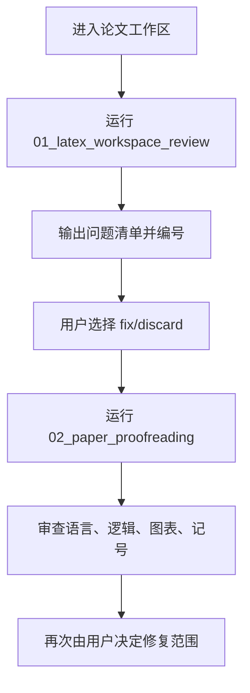

---
aliases:
  - Awesome Claude Code Paper Proofreading
tags:
  - research-agent
  - repo-study
  - paper-proofreading
source_repo: awesome-claudecode-paper-proofreading
source_path: /home/xuyang/code/scholar-agent/awesome-claudecode-paper-proofreading
last_local_commit: e49ed76 2026-03-13 Update em-dash and abstract RESULTS rules
---
# Awesome Claude Code Paper Proofreading：LaTeX 论文校对 prompt 工作流

> [!abstract]
> 这不是“多 agent 仓库”，而是一个非常聚焦的论文校对工作流集合。它把投稿前审查拆成两步：先严格发现问题，再由用户决定是否修复，强制保留人工控制权。

## 项目定位

- README 将其定义为 “Two Claude Code prompts for rigorous proofreading of LaTeX research papers”。
- 使用目标明确聚焦在 robotics 和 computer vision 论文，面向 ICRA、RSS、CVPR、RA-L、T-RO 等级别投稿。
- 项目价值主要来自高质量 review checklist 和人类审稿经验的 prompt 外化，而不是自动化基础设施。

## 仓库构成

- 仓库内容非常精简，核心只有两个 prompt：`01_latex_workspace_review.md` 和 `02_paper_proofreading.md`。
- 第一个 prompt 做 LaTeX 基础设施审计，第二个 prompt 做内容和表达层审稿。
- 没有 skills、agents、commands、hooks，说明它更像“可移植审稿 protocol”。

## 核心工作流

## 研究生命周期覆盖

- 几乎不覆盖研究前期和实验中期。
- 价值集中在论文终稿阶段，尤其是提交前的 LaTeX 一致性、语言质量、图表说明和符号规范。
- 与其说它是“研究 agent”，不如说它是“学术写作质检协议”。

## 集成与依赖面

- 使用方式是在真实论文工作区中启动 Claude Code，然后用绝对路径 `@` 引入 prompt。
- 第二个 prompt 推荐同时提供根 `.tex` 和编译后的 PDF，用于交叉检查图像位置和 PDF 层注释。
- 依赖很轻，但前提是用户已经有成熟的论文工作区和可编译稿件。

## 证据与样例

- 工作方式、prompt 设计和使用步骤见 [awesome-claudecode-paper-proofreading/README.md](../../awesome-claudecode-paper-proofreading/README.md)。
- 具体审查规则见 [awesome-claudecode-paper-proofreading/prompts/01_latex_workspace_review.md](../../awesome-claudecode-paper-proofreading/prompts/01_latex_workspace_review.md)。
- 内容 proofread prompt 见 [awesome-claudecode-paper-proofreading/prompts/02_paper_proofreading.md](../../awesome-claudecode-paper-proofreading/prompts/02_paper_proofreading.md)。
- 本地最近提交为 `e49ed76`，日期 `2026-03-13`。

## 优势

- 边界清晰，用户容易马上上手并理解产出。
- 强制“先检测、后修复”的两阶段机制，能显著降低误改风险。
- 规则密度高，适合高标准 conference/journal 的终稿质检。

## 局限与风险

- 范围极窄，不负责 research ideation、实验、文献调研或整篇自动写作。
- 主要基于 prompt 规范，本身不是可组合的 agent platform。
- 对非 LaTeX 工作流或非英文顶会风格的适配能力有限。

## 适用场景

- 论文已经基本成型，需要投稿前做严格体检。
- 希望保留人工审批，不接受“发现问题后自动大改”。
- 需要一个轻量、可复制、低依赖的高质量 proofread 协议。

## 关联笔记

- [[index]]
- [[summary/academic-research-agents-overview]]
- [[projects/academic-research-skills]]
- [[projects/claude-scholar]]
- [[projects/auto-claude-code-research-in-sleep]]
