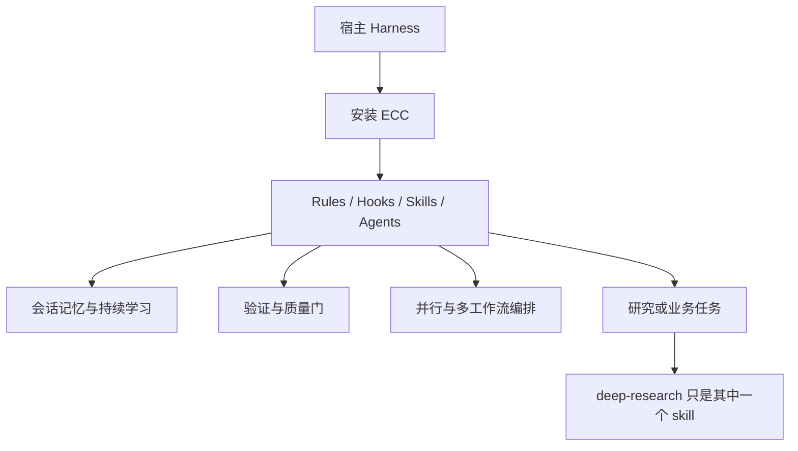

---
aliases:
  - Everything Claude Code
tags:
  - research-agent
  - repo-study
  - harness-baseline
source_repo: everything-claude-code
source_path: /home/xuyang/code/scholar-agent/everything-claude-code
last_local_commit: fdea308 2026-03-13 Merge pull request #428 from zdocapp/zh-CN-pr
---
# Everything Claude Code：通用 Agent Harness 基线

> [!abstract]
> 这个仓库被纳入调研，不是因为它是纯学术研究 agent，而是因为它代表了“agent harness 基础设施”的高配基线。对比它，可以更清楚地看出其他学术项目是在做研究流程，还是在做宿主平台能力。

## 项目定位

- README 将其定义为 “The performance optimization system for AI agent harnesses”，重点是性能、记忆、验证、并行化和持续学习。
- 它面向 Claude Code、Codex、Cursor、OpenCode 等多宿主，不以学术研究为唯一对象。
- 仓库本质上是“通用型 agent 操作系统”，研究只是其中一个应用面。

## 仓库构成

- 根目录就有 `agents/`、`commands/`、`hooks/`、`rules/`、`skills/`、`schemas/`、`tests/` 等完整体系。
- 同时维护 `.claude/`、`.codex/`、`.cursor/`、`.opencode/` 等宿主特定版本，说明它把跨 harness 兼容当成正式工程问题。
- `skills/` 中既有 `deep-research`，也有大量与业务、基础设施、语言工程相关的条目，范围远超学术领域。

## 核心工作流

## 研究生命周期覆盖

- 研究相关能力是“嵌在通用系统里的一个分支”，不是主航道。
- 它更强的地方在运维、路由、质量门、记忆管理、多 harness 兼容，而不是文献综述或论文终稿处理。
- 作为学术项目的对照组，它帮助判断“研究方案需要多少宿主基础设施”。

## 集成与依赖面

- 从仓库结构看，它几乎面向所有主流 AI agent harness。
- README 提到数百测试、Marketplace、GitHub App、hook runtime controls，这说明它是工程化程度很高的生态系统项目。
- 代价是概念很多、范围很大，单纯为了学术研究采用它容易过度建设。

## 证据与样例

- 跨宿主定位、版本演进和 harness-first 叙事见 [everything-claude-code/README.md](../../everything-claude-code/README.md)。
- 中文版目录式说明见 [everything-claude-code/README.zh-CN.md](../../everything-claude-code/README.zh-CN.md)。
- 通用 agent 入口可见 [everything-claude-code/agents](../../everything-claude-code/agents) 与 [everything-claude-code/commands](../../everything-claude-code/commands)。
- 多宿主适配可见 [everything-claude-code/.codex/AGENTS.md](../../everything-claude-code/.codex/AGENTS.md)。
- 本地最近提交为 `fdea308`，日期 `2026-03-13`。

## 优势

- 宿主兼容、工程化治理和长周期使用能力很强。
- 适合作为“研究 agent 平台底盘”或参考实现，而不只是一个 repo of prompts。
- 测试和 hooks 体系完善，适合严肃工程团队借鉴。

## 局限与风险

- 对纯学术研究用户来说，范围明显过大。
- 学术能力不是主线，真正的研究产出 workflow 需要用户自行拼接。
- 信息密度极高，学习成本远高于单用途研究仓库。

## 适用场景

- 想搭建自己的通用 agent harness，再在其上接研究能力。
- 需要跨 Claude/Codex/Cursor/OpenCode 统一规范和工具链。
- 希望把研究任务放进更大规模的工程工作流中治理。

## 关联笔记

- [[index]]
- [[summary/academic-research-agents-overview]]
- [[projects/ai-research-skills]]
- [[projects/claude-scholar]]
- [[projects/claude-code-deep-research]]
