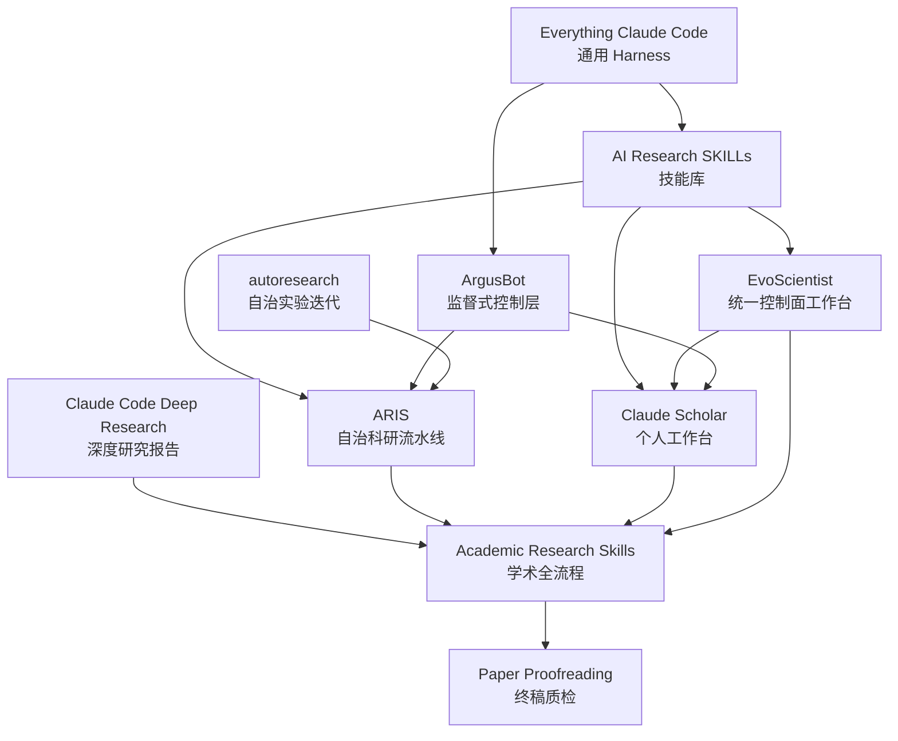
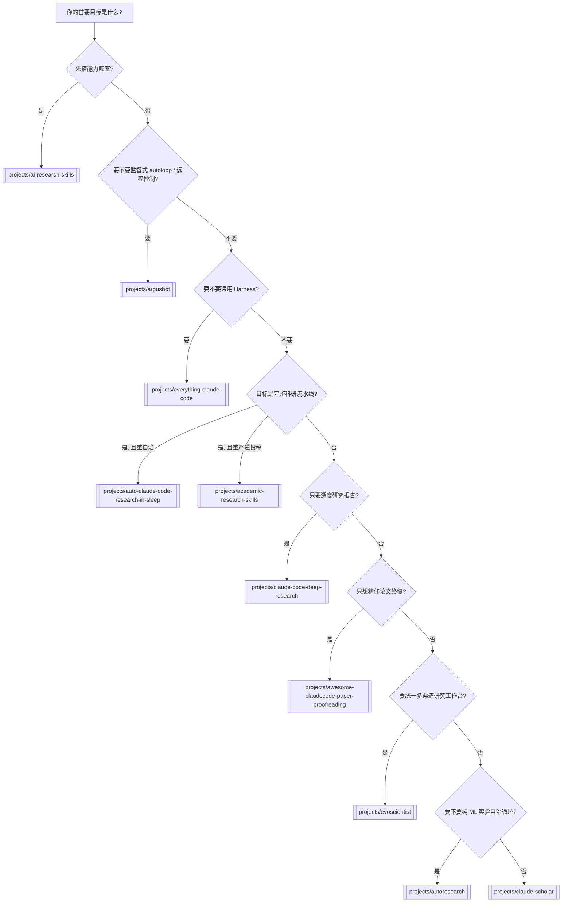

---
aliases:
  - 学术研究 Agent 汇总研究报告
tags:
  - research-agent
  - repo-study
  - summary
source_repo: scholar-agent
source_path: /home/xuyang/code/scholar-agent
last_local_commit: workspace aggregate
---
# 学术研究 Agent 汇总研究报告

> [!abstract]
> 本汇总报告基于 10 个本地仓库的静态调研，目标不是给出唯一冠军，而是建立一张“能力地图”：哪些仓库更像技能库，哪些更像流水线，哪些更像控制层，哪些更像工作台，哪些更像统一运行面，哪些只是终稿质检协议。如果目标已经从“选仓库”转向“做自己的研究系统”，应继续阅读 [[framework/index]]。

## 从调研到框架

- 这份报告现在承担“证据层”角色，回答外部项目分别擅长什么。
- 自有系统蓝图已经单独拆到 [[framework/index]]，不再把这页继续扩写成混合型 manifesto。
- 一个直接结论是：没有任何一个现成仓库同时覆盖平台底盘、能力包、复现账本、实验追踪和可控人工关卡，因此需要单独抽象自己的框架。

## 总览结论

- 如果要找“研究工程能力底座”，优先看 [[projects/ai-research-skills]]。
- 如果要找“过夜自治研究流水线”，优先看 [[projects/auto-claude-code-research-in-sleep]]。
- 如果要找“深度研究报告系统”，优先看 [[projects/claude-code-deep-research]]。
- 如果要找“研究到投稿的严肃管线”，优先看 [[projects/academic-research-skills]]。
- 如果要找“Codex 监督式自治控制层”，优先看 [[projects/argusbot]]。
- 如果要找“论文投稿前终稿质检”，优先看 [[projects/awesome-claudecode-paper-proofreading]]。
- 如果要找“长期个人研究工作台”，优先看 [[projects/claude-scholar]]。
- 如果要找“统一控制面的研究工作台”，优先看 [[projects/evoscientist]]。
- 如果要找”通用 harness 基线”，优先看 [[projects/everything-claude-code]]。
- 如果要找”最轻量的自治 ML 实验循环”，优先看 [[projects/autoresearch]]。

## 项目关系图

## 能力矩阵

| 项目 | 主要形态 | 研究前期 | 实验/执行 | 控制/编排 | 写作/投稿 | 引文/质控 | 宿主范围 | 适合谁 |
| --- | --- | --- | --- | --- | --- | --- | --- | --- |
| [[projects/ai-research-skills]] | 技能库 | 强 | 强 | 弱 | 中 | 中 | 多宿主 | 想增强现有 agent 的团队 |
| [[projects/auto-claude-code-research-in-sleep]] | 自治流水线 | 强 | 强 | 强 | 强 | 强 | 以 Claude + 外部 reviewer 为主 | 想把研究循环过夜跑起来的人 |
| [[projects/claude-code-deep-research]] | 深度研究框架 | 强 | 中 | 中 | 弱 | 强 | Claude Code | 想快速得到 citation-backed 报告的人 |
| [[projects/academic-research-skills]] | 学术全流程管线 | 强 | 中 | 强 | 强 | 很强 | Claude Code | 追求严肃投稿流程的人 |
| [[projects/argusbot]] | 监督式控制层 | 弱 | 强 | 很强 | 弱 | 中 | Codex + Telegram/Feishu | 想让 Codex 长任务持续跑并可远程干预的人 |
| [[projects/awesome-claudecode-paper-proofreading]] | Prompt 协议 | 弱 | 弱 | 弱 | 中 | 很强 | Claude Code | 论文终稿质检需求 |
| [[projects/claude-scholar]] | 个人工作台 | 强 | 强 | 中 | 强 | 中 | Claude/Codex/OpenCode | 长期个人研究与开发用户 |
| [[projects/evoscientist]] | 研究工作台 / 统一控制面 | 强 | 强 | 强 | 中 | 中 | CLI/TUI + 多渠道 + 多供应商 | 想统一研究运行面与会话入口的人 |
| [[projects/everything-claude-code]] | 通用 harness | 中 | 强 | 强 | 弱 | 强 | 多宿主 | 要先搭平台再接研究能力的团队 |
| [[projects/autoresearch]] | 自治实验循环 | 弱 | 很强 | 中 | 弱 | 弱 | agent 无关 | 想让 agent 过夜跑 ML 训练实验的人 |

## 选型决策图

## 定性对比与建议

### 1. 技能库 vs 流水线 vs 控制层

- [[projects/ai-research-skills]] 和 [[projects/everything-claude-code]] 更像平台层资产。
- [[projects/argusbot]] 更像控制层资产，解决的是 reviewer gate、planner snapshot、daemon 和 operator control，而不是研究内容本身。
- [[projects/auto-claude-code-research-in-sleep]]、[[projects/claude-code-deep-research]]、[[projects/academic-research-skills]] 更像可执行的研究流程。
- [[projects/claude-scholar]] 介于两者之间，它不是平台 SDK，也不是固定流水线，而是长期工作台。
- [[projects/evoscientist]] 也属于工作台一类，但更偏统一运行面：它把 channels、sessions、memory、skills 和 MCP 组合成同一控制面。

### 2. 研究严谨度

- [[projects/academic-research-skills]] 在 integrity、review、revision 和 final verification 上最重。
- [[projects/claude-code-deep-research]] 在 citation-backed synthesis 上最专注。
- [[projects/awesome-claudecode-paper-proofreading]] 在终稿层的人工可控质检上最干净。
- [[projects/evoscientist]] 覆盖 `write -> verify`，但从静态证据看，并没有把正式投稿级质量门做成它的核心差异点。

### 3. 自治与执行

- [[projects/auto-claude-code-research-in-sleep]] 最强调自治回路、跨模型 reviewer 和实验执行。
- [[projects/argusbot]] 最强调“持续执行但可被 reviewer/planner/operator 约束”的监督式自治。
- [[projects/claude-scholar]] 更适合研究者长期手动-半自动混合使用。
- [[projects/evoscientist]] 更像“可移动的研究工作台”：会话可持久化，CLI/TUI 与多种消息渠道共享同一 agent runtime。
- [[projects/everything-claude-code]] 提供的是自治运行底座，而不是学术流程本身。
- [[projects/autoresearch]] 范围最窄但最纯粹——只做单文件修改 + 固定预算实验循环，是观察 agent 自治实验能力的最小可行原型。

### 4. 推荐场景

- 想给现有 agent 补研究工程能力：选 [[projects/ai-research-skills]]。
- 想直接搭“研究会自己跑一晚”的系统：选 [[projects/auto-claude-code-research-in-sleep]]。
- 想给 Codex 增加 reviewer-gated autoloop、daemon 和远程操作面：选 [[projects/argusbot]]。
- 想快速产出高质量研究报告：选 [[projects/claude-code-deep-research]]。
- 想要最接近正式投稿工艺的管线：选 [[projects/academic-research-skills]]。
- 想做长期的个人研究/开发环境：选 [[projects/claude-scholar]]。
- 想统一多渠道、多模型、多技能和持久记忆到同一研究入口：选 [[projects/evoscientist]]。
- 想在团队里统一 agent 基础设施：先看 [[projects/everything-claude-code]]，再补 [[projects/ai-research-skills]]。
- 想对现有论文做严格终稿检查：选 [[projects/awesome-claudecode-paper-proofreading]]。
- 想用最少配置让 agent 过夜跑 ML 实验：选 [[projects/autoresearch]]。

## 关键空白带

- 没有任何一个仓库同时在“研究工程广度、实验自治、严肃投稿、通用 harness”四个维度都做到最强。
- 多数仓库依赖 Claude Code 或相关 agent 生态，真正完全宿主无关的只有技能资产层更接近。
- 静态仓库信号强，不等于真实运行成功率强；尤其是长链路项目，实际质量仍受模型、权限、远程环境和数据条件影响。

## 关联笔记

- [[framework/index]]
- [[framework/reference-mapping]]
- [[index]]
- [[projects/ai-research-skills]]
- [[projects/auto-claude-code-research-in-sleep]]
- [[projects/claude-code-deep-research]]
- [[projects/academic-research-skills]]
- [[projects/argusbot]]
- [[projects/awesome-claudecode-paper-proofreading]]
- [[projects/claude-scholar]]
- [[projects/evoscientist]]
- [[projects/everything-claude-code]]
- [[projects/autoresearch]]
