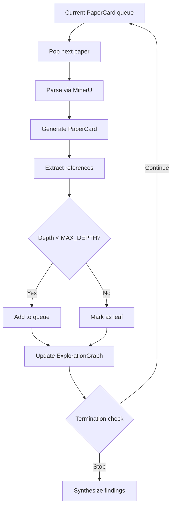

# Mode 1: Bounded Discovery Task

Execute a bounded discovery task for: **$ARGUMENTS**

## Overview

Mode 1 is a **bounded discovery baseline** — not a complete autonomous literature exploration system, but a trackable task with clear milestones, checkpoints, and termination conditions.

```
Seed intake → Literature survey → Exploration loop → Findings synthesis → Outcome report
```

## Constants

- **MAX_DEPTH = 3** — Maximum recursion depth for reference expansion. Stop exploring beyond this depth.
- **MAX_HOURS = 4** — Default time budget. Override via `--budget N`.
- **MINERU_API = http://localhost:8000/parse** — MinerU PDF parsing endpoint. Use to convert PDFs to Markdown.
- **MARGINAL_VALUE_THRESHOLD = 0.3** — Stop when last 3 papers yield < 30% new information (self-assessed).
- **AUTO_PROCEED = true** — If user doesn't respond at checkpoint, auto-proceed with best option.
- **COMPACT = false** — When true, generate compact summary files for session recovery.

> Override: `/mode1-discovery "topic" --depth 5 --budget 8 --seed papers/ref.pdf`

## Input Contract

Parse `$ARGUMENTS` for:

| Parameter | Flag | Required | Description |
|-----------|------|----------|-------------|
| Topic | --topic or first arg | Yes | Natural language research direction/question |
| Seed PDF | --seed | Yes (at least one) | Reference paper PDF path |
| Focus hints | --focus | No | Directions to prioritize |
| Ignore hints | --ignore | No | Sub-areas to skip |
| Depth limit | --depth | No | Override MAX_DEPTH |
| Budget | --budget | No | Override MAX_HOURS in GPU/API cost |
| Stranger mode | --stranger | No | Add research history + frontier trends summary |

## Task Lifecycle

### Phase 1: Intake & Setup

1. **Create discovery task record**:
   ```markdown
   # Discovery Task Record

   **Task ID**: discovery-[timestamp]
   **Topic**: [topic]
   **Seed Papers**: [list PDF paths]
   **Constraints**: depth=[N], budget=[N]h
   **Status**: intake
   **Created**: [timestamp]
   ```

2. **Parse seed papers via MinerU**:
   - Call MinerU API: `POST /parse` with PDF file
   - Store parsed Markdown in `workspace/papers/[paper-id].md`
   - Generate initial PaperCard for each seed paper

3. **HumanGate: Intake Confirmation**
   - Present: topic interpretation, seed paper summaries, planned scope
   - Ask: "Does this capture your intent? Should I adjust focus/ignore areas?"
   - If approved → proceed; if adjustments → refine and re-present

### Phase 2: Literature Survey

Invoke literature survey (adapted from `/research-lit`):

```
/literature-survey "$TOPIC" --sources local,web --seeds $SEED_PDFS
```

**What this does:**
- Build initial landscape: sub-directions, approaches, open problems
- Identify structural gaps and recurring limitations
- Generate `LITERATURE_LANDSCAPE.md`

**Checkpoint:** Present landscape summary. Ask user to confirm scope or adjust.

### Phase 3: Exploration Loop

Execute bounded recursive exploration:



**For each paper:**

1. **Generate PaperCard**:
   ```markdown
   # PaperCard: [paper-id]

   **Title**: [title]
   **Authors**: [authors]
   **Year/Venue**: [year, venue]
   **Source**: MinerU parsed

   ## Core Claim
   [One sentence: what they claim to contribute]

   ## Method Summary
   [2-3 sentences: key technical approach]

   ## Key Results
   [Main quantitative findings]

   ## Evidence Record
   - [ ] Claim 1: [strength of evidence]
   - [ ] Claim 2: [strength of evidence]

   ## Limitations
   [What the paper admits or we identify]

   ## Relations
   - Builds on: [paper-id]
   - Competes with: [paper-id]
   - Extends: [paper-id]

   ## Exploration Status
   - Depth: [N]
   - Priority: [score]
   - Visited: [timestamp]
   ```

2. **Update ExplorationGraph**:
   ```json
   {
     "nodes": ["paper-id-1", "paper-id-2", ...],
     "edges": [{"from": "id1", "to": "id2", "type": "builds_on"}],
     "status": {
       "paper-id-1": {"visited": true, "depth": 1},
       "paper-id-2": {"queued": true, "depth": 2}
     }
   }
   ```

3. **Extract & prioritize references**:
   - Sort by: citation count, relevance to topic, recency
   - Add to queue if depth < MAX_DEPTH

**Termination check (OR logic):**
- Depth >= MAX_DEPTH
- Budget exhausted (time or GPU/API cost)
- Marginal value < threshold (self-assess: did last 3 papers add new info?)

### Phase 4: Findings Synthesis

Compile structured outputs:

1. **Core Findings** — Key insights from exploration
2. **Potential Directions** — Ideas worth further investigation
3. **Method Summary** — Common approaches, experimental paradigms
4. **Research History** — (if --stranger) timeline, frontier trends

If user provided an idea: generate **Feasibility Validation Report**:
```markdown
# Feasibility Validation: [user-idea]

## Evidence Support
[List literature evidence supporting the idea]

## Risks & Constraints
[List technical/resource limitations]

## Minimum Validation Design
[Smallest experiment to test feasibility]

## Recommendation
Proceed / Pivot / Needs more investigation
```

### Phase 5: Outcome Report

Generate `DISCOVERY_OUTCOME.md`:

```markdown
# Discovery Outcome Report

**Task**: discovery-[id]
**Topic**: [topic]
**Duration**: [actual hours]
**Status**: completed / budget-exhausted / user-cancelled

## Exploration Statistics
- Papers explored: [N]
- Depth reached: [max N]
- Termination reason: [reason]

## Key Findings
1. [Finding 1]
2. [Finding 2]
3. [Finding 3]

## Literature Landscape
[Summary from Phase 2]

## PaperCards Generated
[List of PaperCard files]

## ExplorationGraph
[Graph summary: nodes, edges, coverage]

## Potential Directions
1. [Direction 1] — feasibility: [assessment]
2. [Direction 2] — feasibility: [assessment]

## Next Steps
- [ ] Follow specific direction: `/mode2-reproduction [target-paper]`
- [ ] Deep dive on specific paper: `/mode1-discovery --seed [paper]`
- [ ] Review PaperCards for idea synthesis
```

## State Persistence

Write `TASK_STATE.json` after each phase:

```json
{
  "taskId": "discovery-...",
  "phase": "exploration_loop",
  "depthReached": 2,
  "papersExplored": 15,
  "budgetUsed": 2.5,
  "status": "in_progress",
  "timestamp": "2026-04-07T12:00:00"
}
```

**On context compaction**: Read `TASK_STATE.json` and latest PaperCards to resume.

## Dashboard Requirements

Task must expose to dashboard:
- Current phase and status
- Milestone/checkpoint timeline
- Recent artifacts (PaperCards, ExplorationGraph snippets)
- Resource usage (time elapsed, budget consumed)

## Key Rules

- **Parse PDFs via MinerU**: Always use MinerU API for PDF → Markdown conversion
- **Boundaries are hard**: Stop at depth/budget limit, no exceptions
- **Document failures**: Parsing failures, dead links → formal artifact states
- **PaperCards are primary**: Every explored paper gets a PaperCard
- **ExplorationGraph tracks progress**: Update after each paper
- **Checkpoint before expansion**: Ask user at intake and post-survey phases
- **Failures are valid outcomes**: A terminated discovery is still a completed task

## Non-Goals (Explicit)

- NOT complete autonomous literature graph building
- NOT guarantee high-quality idea validation
- NOT automatic paper reproduction (that's Mode 2)
- NOT full ExplorationGraph semantics from blueprint (baseline only)